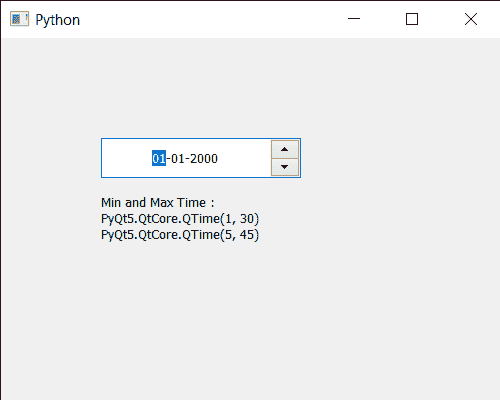

# PyQt5 qdate edit–可设置的设置时间范围

> 原文:[https://www . geeksforgeeks . org/pyqt 5-qdate edit-setting-time-range-哪些可以设置/](https://www.geeksforgeeks.org/pyqt5-qdateedit-setting-time-range-which-can-be-set/)

在本文中，我们将看到如何将时间范围设置为 QDateEdit。有时需要设置时间范围，以便用户不能输入/存储超出时间范围的时间。我们可以借助`setTime`方法将时间设置为日期编辑。借助`setMinimumTime`和`setMaximumTime`方法，可以将最短和最长时间设置为日期编辑。

为了做到这一点，我们对 QDateEdit 对象使用`setTimeRange`方法

> **语法:** date.setTimeRange(t1，t2)
> 
> **自变量:**取两个 QTime 对象作为自变量
> 
> **返回:**返回无

下面是实现

```py
# importing libraries
from PyQt5.QtWidgets import * 
from PyQt5 import QtCore, QtGui
from PyQt5.QtGui import * 
from PyQt5.QtCore import * 
import sys

class Window(QMainWindow):

    def __init__(self):
        super().__init__()

        # setting title
        self.setWindowTitle("Python ")

        # setting geometry
        self.setGeometry(100, 100, 500, 400)

        # calling method
        self.UiComponents()

        # showing all the widgets
        self.show()

    # method for components
    def UiComponents(self):

        # creating a QDateEdit widget
        date = QDateEdit(self)

        # setting geometry of the date edit
        date.setGeometry(100, 100, 200, 40)

        # alignment
        a_flag = Qt.AlignCenter

        # setting alignment of date
        date.setAlignment(a_flag)

        # QTime object
        t1 = QTime(1, 30)
        t2 = QTime(5, 45)

        # setting minimum time
        date.setTimeRange(t1, t2)

        # creating a label
        label = QLabel("GeeksforGeeks", self)

        # setting geometry
        label.setGeometry(100, 150, 250, 60)

        # making label multiline
        label.setWordWrap(True)

        # getting time
        value1 = date.minimumTime()
        value2 = date.maximumTime()

        # setting text to the label
        label.setText("Min and Max Time : " + str(value1) + " " + str(value2))

# create pyqt5 app
App = QApplication(sys.argv)

# create the instance of our Window
window = Window()

# start the app
sys.exit(App.exec())
```

**输出:**
