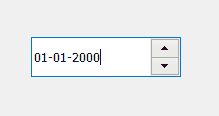

# pyqt 5–qdateedit

> 哎哎哎::1230【https://www . geeksforgeeks . org/pyqt 5-qdateedit/

**QDateEdit** 是提供日期信息的类，允许用户输入日期。它允许用户通过使用键盘或箭头键来增加和减少日期来编辑日期。它是主要用于获取输入日期的小部件。下面是日期编辑小部件的外观



**示例:**
一个带有 QDateEdit 的窗口，用户可以在其中输入任何日期，当用户在更改日期后按 enter 时，输入的日期将显示在标签中

下面是实现

```
# importing libraries
from PyQt5.QtWidgets import * 
from PyQt5 import QtCore, QtGui
from PyQt5.QtGui import * 
from PyQt5.QtCore import * 
import sys

class Window(QMainWindow):

    def __init__(self):
        super().__init__()

        # setting title
        self.setWindowTitle("Python ")

        # setting geometry
        self.setGeometry(100, 100, 500, 400)

        # calling method
        self.UiComponents()

        # showing all the widgets
        self.show()

    # method for components
    def UiComponents(self):

        # creating a QDateEdit widget
        date = QDateEdit(self)

        # setting geometry of the date edit
        date.setGeometry(100, 100, 150, 40)

        # creating a label
        label = QLabel("GeeksforGeeks", self)

        # setting geometry
        label.setGeometry(100, 150, 200, 60)

        # making label multiline
        label.setWordWrap(True)

        # adding action to the date when enter key is pressed
        date.editingFinished.connect(lambda: date_method())

        # method called by date edit
        def date_method():

            # getting the date
            value = date.date()

            # setting text to the label
            label.setText("Selected Date : " + str(value))

# create pyqt5 app
App = QApplication(sys.argv)

# create the instance of our Window
window = Window()

# start the app
sys.exit(App.exec())
```

**输出:**

<video class="wp-video-shortcode" id="video-444139-1" width="640" height="512" preload="metadata" controls=""><source type="video/mp4" src="https://media.geeksforgeeks.org/wp-content/uploads/20200702015708/Python-2020-07-02-01-56-45.mp4?_=1">[https://media.geeksforgeeks.org/wp-content/uploads/20200702015708/Python-2020-07-02-01-56-45.mp4](https://media.geeksforgeeks.org/wp-content/uploads/20200702015708/Python-2020-07-02-01-56-45.mp4)</video>