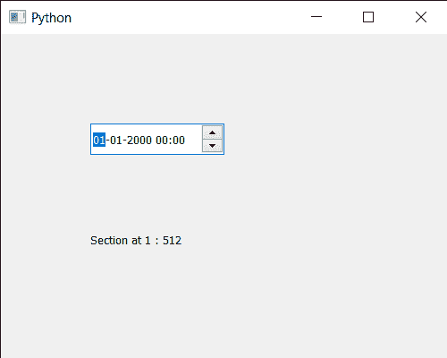

# PYqt 5 QDateTimeedit–在给定索引处查找部分

> 原文:[https://www . geesforgeks . org/pyqt 5-qdatetime edit-find-section-at-given-index/](https://www.geeksforgeeks.org/pyqt5-qdatetimeedit-finding-section-at-given-index/)

在本文中，我们将看到如何在 QDateTimeEdit 小部件中找到给定索引处的部分。在 QDateTimeedit 小部件中有许多部分，如年、月、小时、分钟部分。所以有时候，我们有必要得到这一节的具体指数。

为了做到这一点，我们将使用`sectionAt`方法和 QDateTimeEdit 对象。

> **语法 ：** 日期时间编辑.sectionAt（n）
> 
> **自变量:**以整数为自变量
> 
> **Return :** 返回截面对象，但打印时显示其对应值。

下面是实现

```
# importing libraries
from PyQt5.QtWidgets import * 
from PyQt5 import QtCore, QtGui
from PyQt5.QtGui import * 
from PyQt5.QtCore import * 
import sys

class Window(QMainWindow):

    def __init__(self):
        super().__init__()

        # setting title
        self.setWindowTitle("Python ")

        # setting geometry
        self.setGeometry(100, 100, 500, 400)

        # calling method
        self.UiComponents()

        # showing all the widgets
        self.show()

    # method for components
    def UiComponents(self):

        # creating a QDateTimeEdit widget
        datetimeedit = QDateTimeEdit(self)

        # setting geometry
        datetimeedit.setGeometry(100, 100, 150, 35)

        # creating a label
        label = QLabel("GeeksforGeeks", self)

        # setting geometry to the label
        label.setGeometry(100, 200, 200, 60)

        # making label multi line
        label.setWordWrap(True)

        # getting section at index 1
        value = datetimeedit.sectionAt(1)

        # setting text to the label
        label.setText("Section at 1 : " + str(value))

# create pyqt5 app
App = QApplication(sys.argv)

# create the instance of our Window
window = Window()

# start the app
sys.exit(App.exec())
```

**输出:**
