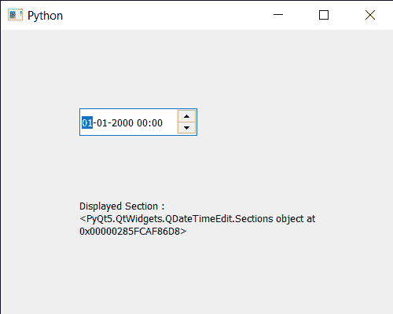

# PyQt5 qdatetime 编辑–获取所有显示的部分

> 原文:[https://www . geesforgeks . org/pyqt5-qdatetime edit-获取所有显示的部分/](https://www.geeksforgeeks.org/pyqt5-qdatetimeedit-getting-all-the-displayed-sections/)

在本文中，我们将看到如何获得 QDateTimeEdit 小部件的所有显示部分。在 QDateTimeedit 小部件中有许多部分，如年、月、小时、分钟部分。用户可以在鼠标或键盘的帮助下选择任何部分，并对当前部分执行递增和递减操作。QDateTimeEdit 的某些部分默认情况下是不可见的，比如毫秒部分。

为了做到这一点，我们将使用`displayedSections`方法和 QDateTimeEdit 对象。

> **语法:**datetimeedit . display edseteons()
> 
> **论证:**不需要论证
> 
> **返回:**返回 Sections 对象

下面是实现

```
# importing libraries
from PyQt5.QtWidgets import * 
from PyQt5 import QtCore, QtGui
from PyQt5.QtGui import * 
from PyQt5.QtCore import * 
import sys

class Window(QMainWindow):

    def __init__(self):
        super().__init__()

        # setting title
        self.setWindowTitle("Python ")

        # setting geometry
        self.setGeometry(100, 100, 500, 400)

        # calling method
        self.UiComponents()

        # showing all the widgets
        self.show()

    # method for components
    def UiComponents(self):

        # creating a QDateTimeEdit widget
        datetimeedit = QDateTimeEdit(self)

        # setting geometry
        datetimeedit.setGeometry(100, 100, 150, 35)

        # creating a label
        label = QLabel("GeeksforGeeks", self)

        # setting geometry to the label
        label.setGeometry(100, 200, 300, 80)

        # making label multi line
        label.setWordWrap(True)

        # getting displayed sections
        value = datetimeedit.displayedSections()

        # setting text to the label
        label.setText("Displayed Section : " + str(value))

# create pyqt5 app
App = QApplication(sys.argv)

# create the instance of our Window
window = Window()

# start the app
sys.exit(App.exec())
```

**输出:**
