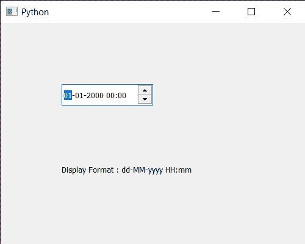

# PYqt5 QDateTimeedit–获取显示格式

> 原文:[https://www . geesforgeks . org/pyqt 5-qdatetime edit-get-display-format/](https://www.geeksforgeeks.org/pyqt5-qdatetimeedit-getting-display-format/)

在本文中，我们将看到如何获得 QDateTimeEdit 的显示格式。显示格式属性保存用于显示日期-时间编辑的时间/日期的格式。默认情况下，我们看到的日期格式类似于 01-01-2000，尽管通过设置显示格式，我们可以将该日期设为 2020 年 1 月 1 日，但可以借助`setDisplayFormat`方法进行设置。

为了做到这一点，我们将使用`displayFormat`方法和 QDateTimeEdit 对象。

> **语法:** datetimeedit.displayFormat()
> 
> **论证:**不需要论证
> 
> **返回:**返回字符串

下面是实现

```
# importing libraries
from PyQt5.QtWidgets import * 
from PyQt5 import QtCore, QtGui
from PyQt5.QtGui import * 
from PyQt5.QtCore import * 
import sys

class Window(QMainWindow):

    def __init__(self):
        super().__init__()

        # setting title
        self.setWindowTitle("Python ")

        # setting geometry
        self.setGeometry(100, 100, 500, 400)

        # calling method
        self.UiComponents()

        # showing all the widgets
        self.show()

    # method for components
    def UiComponents(self):

        # creating a QDateTimeEdit widget
        datetimeedit = QDateTimeEdit(self)

        # setting geometry
        datetimeedit.setGeometry(100, 100, 150, 35)

        # creating a label
        label = QLabel("GeeksforGeeks", self)

        # setting geometry to the label
        label.setGeometry(100, 200, 300, 80)

        # making label multi line
        label.setWordWrap(True)

        # getting display format
        value = datetimeedit.displayFormat()

        # setting text to the label
        label.setText("Display Format : " + value)

# create pyqt5 app
App = QApplication(sys.argv)

# create the instance of our Window
window = Window()

# start the app
sys.exit(App.exec())
```

**输出:**
