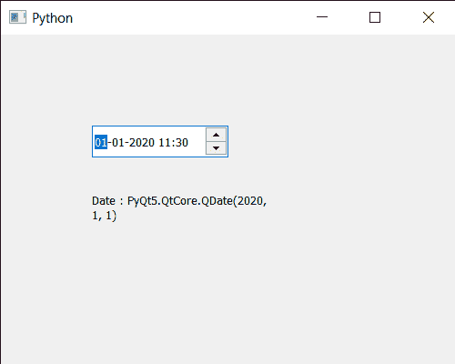

# pyqt 5 QDate time edit–仅获取 QDate

> 原文:[https://www . geesforgeks . org/pyqt 5-qdatetime edit-get-only-qdate/](https://www.geeksforgeeks.org/pyqt5-qdatetimeedit-getting-only-qdate/)

在本文中，我们将看到如何只获取 QDateTimeEdit 小部件的 QDate。QDateTime 基本上是 QDate 和 QTime 的组合，即它既有日期又有时间。而 QDateTimeEdit 小部件用于显示或接收 QDateTime。我们可以借助`setDateTime`方法将 QDateTime 设置为它。设置日期不会影响 QDateTimeEdit 的时间，可以借助`setDate`方法进行设置。

为了做到这一点，我们将使用`date`方法和 QDateTimeEdit 对象。

> **语法 ：** datetimeedit.date（）
> 
> **论证:**不需要论证
> 
> **返回:**返回 QDate 对象

下面是实现

```py
# importing libraries
from PyQt5.QtWidgets import * 
from PyQt5 import QtCore, QtGui
from PyQt5.QtGui import * 
from PyQt5.QtCore import * 
import sys

class Window(QMainWindow):

    def __init__(self):
        super().__init__()

        # setting title
        self.setWindowTitle("Python ")

        # setting geometry
        self.setGeometry(100, 100, 500, 400)

        # calling method
        self.UiComponents()

        # showing all the widgets
        self.show()

    # method for components
    def UiComponents(self):

        # creating a QDateTimeEdit widget
        datetimeedit = QDateTimeEdit(self)

        # setting geometry
        datetimeedit.setGeometry(100, 100, 150, 35)

        # setting date time to it
        datetimeedit.setDateTime(QDateTime(2020, 10, 10, 11, 30))

        # date
        date = QDate(2020, 1, 1)

        # setting only date
        datetimeedit.setDate(date)

        # creating a label
        label = QLabel("GeeksforGeeks", self)

        # setting geometry to the label
        label.setGeometry(100, 160, 200, 60)

        # making label multi line
        label.setWordWrap(True)

        # getting current date
        value = datetimeedit.date()

        # setting text to the label
        label.setText("Date : " + str(value))

# create pyqt5 app
App = QApplication(sys.argv)

# create the instance of our Window
window = Window()

# start the app
sys.exit(App.exec())
```

**输出:**

