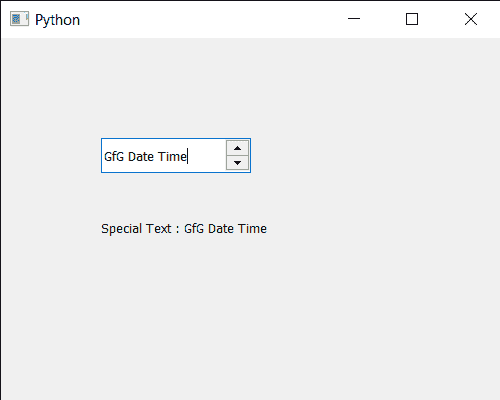

# PyQt5 qdatetime 编辑–获取特殊日期时间文本

> 原文:[https://www . geesforgeks . org/pyqt 5-qdatetime edit-get-special-date-time-text/](https://www.geeksforgeeks.org/pyqt5-qdatetimeedit-getting-special-date-time-text/)

在本文中，我们将看到如何获得 QDateTimeEdit 小部件的特殊日期时间文本。借助`setSpecialValueText`方法设置特殊文本，只要当前值等于最小日期时间，QDateTimeEdit 就会显示该特殊文本，而不是日期时间值。

为了做到这一点，我们将使用`specialValueText`方法和 QDateTimeEdit 对象。

> **语法:**datetimeedit . specialaluetext()
> 
> **论证:**不需要论证
> 
> **返回:**返回字符串

下面是实现

```py
# importing libraries
from PyQt5.QtWidgets import * 
from PyQt5 import QtCore, QtGui
from PyQt5.QtGui import * 
from PyQt5.QtCore import * 
import sys

class Window(QMainWindow):

    def __init__(self):
        super().__init__()

        # setting title
        self.setWindowTitle("Python ")

        # setting geometry
        self.setGeometry(100, 100, 500, 400)

        # calling method
        self.UiComponents()

        # showing all the widgets
        self.show()

    # method for components
    def UiComponents(self):

        # creating a QDateTimeEdit widget
        datetimeedit = QDateTimeEdit(self)

        # setting geometry
        datetimeedit.setGeometry(100, 100, 150, 35)

        # minimum date time
        min_dt = QDateTime(2020, 10, 10, 11, 30)

        # setting minimum date time
        datetimeedit.setMinimumDateTime(min_dt)

        # text
        text = "GfG Date Time"

        # setting special text to the date time edit
        datetimeedit.setSpecialValueText(text)

        # creating a label
        label = QLabel("GeeksforGeeks", self)

        # setting geometry to the label
        label.setGeometry(100, 160, 200, 60)

        # making label multi line
        label.setWordWrap(True)

        # getting special text
        value = datetimeedit.specialValueText()

        # setting text to the label
        label.setText("Special Text : " + str(value))

# create pyqt5 app
App = QApplication(sys.argv)

# create the instance of our Window
window = Window()

# start the app
sys.exit(App.exec())
```

**输出:**
