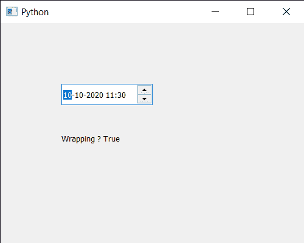

# PyQt5 qdatetime edit–获取包装属性

> 原文:[https://www . geeksforgeeks . org/pyqt 5-qdatetime edit-get-wrapping-property/](https://www.geeksforgeeks.org/pyqt5-qdatetimeedit-getting-wrapping-property/)

在本文中，我们将看到如何获得 QDateTimeEdit 小部件的包装属性。QDateTime 基本上是 QDate 和 QTime 的组合，即它既有日期又有时间。而 QDateTimeEdit 小部件用于显示或接收 QDateTime。包装属性使得从最大日期时间到最小日期时间的逐步增加将花费用户，反之亦然。只有我们设置了最小和最大日期时间，包装才有意义，可以借助`setWrapping`方法进行设置。

为了做到这一点，我们将使用`wrapping`方法和 QDateTimeEdit 对象。

> **语法:** datetimeedit.wrapping()
> 
> **论证:**不需要论证
> 
> **返回:**返回 bool

下面是实现

```
# importing libraries
from PyQt5.QtWidgets import * 
from PyQt5 import QtCore, QtGui
from PyQt5.QtGui import * 
from PyQt5.QtCore import * 
import sys

class Window(QMainWindow):

    def __init__(self):
        super().__init__()

        # setting title
        self.setWindowTitle("Python ")

        # setting geometry
        self.setGeometry(100, 100, 500, 400)

        # calling method
        self.UiComponents()

        # showing all the widgets
        self.show()

    # method for components
    def UiComponents(self):

        # creating a QDateTimeEdit widget
        datetimeedit = QDateTimeEdit(self)

        # setting geometry
        datetimeedit.setGeometry(100, 100, 150, 35)

        # date time
        dt1 = QDateTime(2020, 10, 10, 11, 30)
        dt2 = QDateTime(2025, 10, 20, 22, 40)

        # setting minimum date time to it
        datetimeedit.setDateTimeRange(dt1, dt2)

        # setting wrapping property
        datetimeedit.setWrapping(True)

        # creating a label
        label = QLabel("GeeksforGeeks", self)

        # setting geometry to the label
        label.setGeometry(100, 160, 200, 60)

        # making label multi line
        label.setWordWrap(True)

        # getting wrapping property
        value = datetimeedit.wrapping()

        # setting text to the label
        label.setText("Wrapping ? " + str(value))

# create pyqt5 app
App = QApplication(sys.argv)

# create the instance of our Window
window = Window()

# start the app
sys.exit(App.exec())
```

**输出:**
