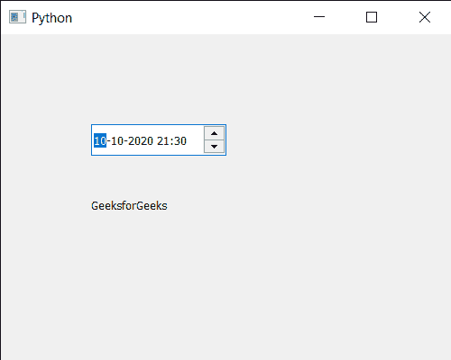

# PyQt5 QDateTimeEdit – 设置 QDateTime

> 原文:[https://www . geesforgeks . org/pyqt 5-qdatetime edit-setting-qdatetime-to-it/](https://www.geeksforgeeks.org/pyqt5-qdatetimeedit-setting-qdatetime-to-it/)

在本文中，我们将看到如何将 QDateTime 对象设置为 QDateTimeEdit 小部件。QDateTime 基本上是 QDate 和 QTime 的组合，即它既有日期又有时间。而 QDateTimeEdit 小部件用于显示或接收 QDateTime。

为了做到这一点，我们将使用`setDateTime`方法和 QDateTimeEdit 对象。

> **语法:** datetimeedit.setDateTime(dt)
> 
> **参数:**它以 QDateTime 对象为参数
> 
> **返回:**返回无

下面是实现

```
# importing libraries
from PyQt5.QtWidgets import * 
from PyQt5 import QtCore, QtGui
from PyQt5.QtGui import * 
from PyQt5.QtCore import * 
import sys

class Window(QMainWindow):

    def __init__(self):
        super().__init__()

        # setting title
        self.setWindowTitle("Python ")

        # setting geometry
        self.setGeometry(100, 100, 500, 400)

        # calling method
        self.UiComponents()

        # showing all the widgets
        self.show()

    # method for components
    def UiComponents(self):

        # creating a QDateTimeEdit widget
        datetimeedit = QDateTimeEdit(self)

        # setting geometry
        datetimeedit.setGeometry(100, 100, 150, 35)

        # creating a label
        label = QLabel("GeeksforGeeks", self)

        # setting geometry to the label
        label.setGeometry(100, 160, 200, 60)

        # making label multi line
        label.setWordWrap(True)

        # QDateTime
        dt = QDateTime(2020, 10, 10, 21, 30)

        # setting date time to datetimeedit
        datetimeedit.setDateTime(dt)

# create pyqt5 app
App = QApplication(sys.argv)

# create the instance of our Window
window = Window()

# start the app
sys.exit(App.exec())
```

**输出:**
