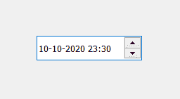

# PyQt5 – QDateTimeEdit

> 哎哎哎::1230【https://www . geeksforgeeks . org/pyqt 5-qdatetimeedit/

**QDateTimeEdit** 允许用户使用键盘或箭头键增加和减少日期和时间值来编辑日期。箭头键可用于在“日期时间编辑”框中从一个部分移动到另一个部分。日期和时间根据设置的格式显示。下面是 QDateTimeEdit 的外观



**示例:**
一个窗口有一个 QDateTimeEdit 小部件和标签，每次日期时间小部件中的值改变标签时，就会显示当前的日期时间。

下面是实现

```py
# importing libraries
from PyQt5.QtWidgets import * 
from PyQt5 import QtCore, QtGui
from PyQt5.QtGui import * 
from PyQt5.QtCore import * 
import sys

class Window(QMainWindow):

    def __init__(self):
        super().__init__()

        # setting title
        self.setWindowTitle("Python ")

        # setting geometry
        self.setGeometry(100, 100, 500, 400)

        # calling method
        self.UiComponents()

        # showing all the widgets
        self.show()

    # method for components
    def UiComponents(self):

        # creating a QDateTimeEdit widget
        datetime = QDateTimeEdit(self)

        # setting geometry
        datetime.setGeometry(100, 100, 150, 35)

        # creating a label
        label = QLabel("GeeksforGeeks", self)

        # setting geometry to the label
        label.setGeometry(100, 160, 200, 60)

        # making label multi line
        label.setWordWrap(True)

        # adding action to the datetime
        datetime.dateTimeChanged.connect(lambda: dt_method())

        # method called by the datetime
        def dt_method():

            # getting current datetime
            value = datetime.dateTime()

            # setting text to the label
            label.setText("Current date time : " + str(value))

# create pyqt5 app
App = QApplication(sys.argv)

# create the instance of our Window
window = Window()

# start the app
sys.exit(App.exec())
```

**输出:**

<video class="wp-video-shortcode" id="video-449810-1" width="640" height="512" preload="metadata" controls=""><source type="video/mp4" src="https://media.geeksforgeeks.org/wp-content/uploads/20200710020919/Python-2020-07-10-02-08-47.mp4?_=1">[https://media.geeksforgeeks.org/wp-content/uploads/20200710020919/Python-2020-07-10-02-08-47.mp4](https://media.geeksforgeeks.org/wp-content/uploads/20200710020919/Python-2020-07-10-02-08-47.mp4)</video>