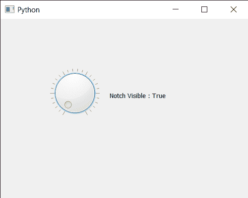

# PyQt5 QDial–获得缺口可见属性

> 原文:[https://www . geeksforgeeks . org/pyqt 5-q dial-get-notch-visible-property/](https://www.geeksforgeeks.org/pyqt5-qdial-getting-notch-visible-property/)

在本文中，我们将看到如何获得 QDial 的凹口可见属性，默认情况下 QDial 的凹口是禁用的，尽管我们可以借助`setNotchesVisible`方法使其随时可见。凹口基本上是围绕表盘绘制的一系列凹口，用于指示可用值的范围。

为此，我们对 QDial 对象使用`notchesVisible`方法

> **语法:**dial . notchess visible(True)
> 
> **论证:**不需要论证
> 
> **返回:**返回 bool

下面是实现

```
# importing libraries
from PyQt5.QtWidgets import * 
from PyQt5 import QtCore, QtGui
from PyQt5.QtGui import * 
from PyQt5.QtCore import * 
import sys

class Window(QMainWindow):

    def __init__(self):
        super().__init__()

        # setting title
        self.setWindowTitle("Python ")

        # setting geometry
        self.setGeometry(100, 100, 500, 400)

        # calling method
        self.UiComponents()

        # showing all the widgets
        self.show()

    # method for components
    def UiComponents(self):

        # creating QDial object
        dial = QDial(self)

        # setting geometry to the dial
        dial.setGeometry(100, 100, 100, 100)

        # making notch visible
        dial.setNotchesVisible(True)

        # creating a label
        label = QLabel("GeeksforGeeks", self)

        # setting geometry to the label
        label.setGeometry(220, 125, 200, 60)

        # making label multiline
        label.setWordWrap(True)

        # getting notch visible property
        value = dial.notchesVisible()

        # setting text to the label
        label.setText("Notch Visible : " + str(value))

# create pyqt5 app
App = QApplication(sys.argv)

# create the instance of our Window
window = Window()

# start the app
sys.exit(App.exec())
```

**输出:**
