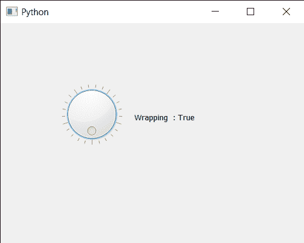

# PyQt5 QDial–获得包裹属性

> 原文:[https://www . geeksforgeeks . org/pyqt 5-q dial-get-wrapping-property/](https://www.geeksforgeeks.org/pyqt5-qdial-getting-wrapping-property/)

在本文中，我们将看到如何获得 QDial 的包装属性。默认情况下，当我们创建 QDial 时，最小值和最大值之间有一些空间，通过启用包装属性，我们可以删除额外的空间，否则会在 Dial 的底部插入一些空间来分隔有效值范围的末端。可以借助`setWrapping`方法设置包裹属性。

为此，我们对 QDial 对象使用`wrapping`方法

> **语法:**拨号.换行()
> 
> **论证:**不需要论证
> 
> **返回:**返回 bool

下面是实现

```
# importing libraries
from PyQt5.QtWidgets import * 
from PyQt5 import QtCore, QtGui
from PyQt5.QtGui import * 
from PyQt5.QtCore import * 
import sys

class Window(QMainWindow):

    def __init__(self):
        super().__init__()

        # setting title
        self.setWindowTitle("Python ")

        # setting geometry
        self.setGeometry(100, 100, 500, 400)

        # calling method
        self.UiComponents()

        # showing all the widgets
        self.show()

    # method for components
    def UiComponents(self):

        # creating QDial object
        dial = QDial(self)

        # setting geometry to the dial
        dial.setGeometry(100, 100, 100, 100)

        # making notch visible
        dial.setNotchesVisible(True)

        # enabling wrapping property
        dial.setWrapping(True)

        # creating a label
        label = QLabel("GeeksforGeeks", self)

        # setting geometry to the label
        label.setGeometry(220, 125, 200, 60)

        # making label multiline
        label.setWordWrap(True)

        # getting wrapping property
        value = dial.wrapping()

        # setting text to the label
        label.setText("Wrapping  : " + str(value))

# create pyqt5 app
App = QApplication(sys.argv)

# create the instance of our Window
window = Window()

# start the app
sys.exit(App.exec())
```

**输出:**
