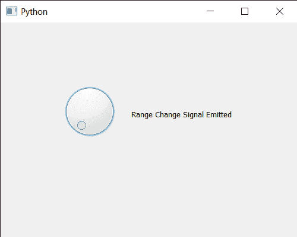

# PyQt5 QDial–范围改变信号

> 原文:[https://www . geesforgeks . org/pyqt 5-q dial-range-changed-signal/](https://www.geeksforgeeks.org/pyqt5-qdial-range-changed-signal/)

在本文中，我们将了解如何获得 QDial 的范围变化信号。该信号在滑块范围改变时发出，默认情况下，QDial 的范围为 0 到 99，尽管我们可以借助`setRange`方法随时改变。

为此，我们对 QDial 对象使用`rangeChanged`方法

> **语法:** dial.rangeChanged.connect(方法)
> 
> **自变量:**以方法为自变量
> 
> **返回:**返回无

下面是实现

```py
# importing libraries
from PyQt5.QtWidgets import * 
from PyQt5 import QtCore, QtGui
from PyQt5.QtGui import * 
from PyQt5.QtCore import * 
import sys

class Window(QMainWindow):

    def __init__(self):
        super().__init__()

        # setting title
        self.setWindowTitle("Python ")

        # setting geometry
        self.setGeometry(100, 100, 500, 400)

        # calling method
        self.UiComponents()

        # showing all the widgets
        self.show()

    # method for components
    def UiComponents(self):

        # creating QDial object
        dial = QDial(self)

        # setting geometry to the dial
        dial.setGeometry(100, 100, 100, 100)

        # creating a label
        label = QLabel("GeeksforGeeks", self)

        # setting geometry to the label
        label.setGeometry(220, 125, 200, 60)

        # making label multiline
        label.setWordWrap(True)

        # range changed signal
        dial.rangeChanged.connect(lambda: label.setText("Range Change Signal Emitted"))

        # setting range of dial
        dial.setRange(0, 1000)

# create pyqt5 app
App = QApplication(sys.argv)

# create the instance of our Window
window = Window()

# start the app
sys.exit(App.exec())
```

**输出:**
