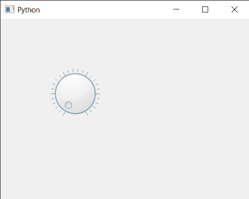

# PyQt5 QDial–设置方向属性

> 原文:[https://www . geesforgeks . org/pyqt 5-qdial-setting-orientation-property/](https://www.geeksforgeeks.org/pyqt5-qdial-setting-orientation-property/)

在本文中，我们将看到如何设置 QDial 的方向属性。此属性保持滑块的方向，方向必须是垂直(默认)或水平。对于垂直方向，关联值为 2，对于水平方向，关联值为 1。

为此，我们对 QDial 对象使用`setOrientation`方法

> **语法:** dial.setOrientation(方向)
> 
> **自变量:**以方位对象为自变量
> 
> **返回:**返回无

下面是实现

```py
# importing libraries
from PyQt5.QtWidgets import * 
from PyQt5 import QtCore, QtGui
from PyQt5.QtGui import * 
from PyQt5.QtCore import * 
import sys

class Window(QMainWindow):

    def __init__(self):
        super().__init__()

        # setting title
        self.setWindowTitle("Python ")

        # setting geometry
        self.setGeometry(100, 100, 500, 400)

        # calling method
        self.UiComponents()

        # showing all the widgets
        self.show()

    # method for components
    def UiComponents(self):

        # creating QDial object
        dial = QDial(self)

        # setting geometry to the dial
        dial.setGeometry(100, 100, 100, 100)

        # making notch visible
        dial.setNotchesVisible(True)

        # setting orientation to it
        dial.setOrientation(Qt.Horizontal)

# create pyqt5 app
App = QApplication(sys.argv)

# create the instance of our Window
window = Window()

# start the app
sys.exit(App.exec())
```

**输出:**
