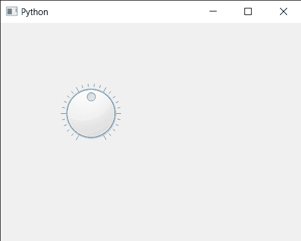

# PyQt5 QDial–设置滑块的值

> 原文:[https://www . geesforgeks . org/pyqt 5-qdial-设置-滑块-值/](https://www.geeksforgeeks.org/pyqt5-qdial-setting-sliders-value/)

在本文中，我们将了解如何设置 QDial 的滑块值。用户可以在鼠标的帮助下改变值，尽管我们也可以通过编程来改变它。滑块强制该值在合法范围内，即该值应大于或等于最小值，并且应小于或等于最大值。更改该值也会更改滑块位置。

为此，我们对 QDial 对象使用`setValue`方法

> **语法:** dial.setValue(n)
> 
> **自变量:**以整数为自变量
> 
> **返回:**返回无

下面是实现

```py
# importing libraries
from PyQt5.QtWidgets import * 
from PyQt5 import QtCore, QtGui
from PyQt5.QtGui import * 
from PyQt5.QtCore import * 
import sys

class Window(QMainWindow):

    def __init__(self):
        super().__init__()

        # setting title
        self.setWindowTitle("Python ")

        # setting geometry
        self.setGeometry(100, 100, 500, 400)

        # calling method
        self.UiComponents()

        # showing all the widgets
        self.show()

    # method for components
    def UiComponents(self):

        # creating QDial object
        dial = QDial(self)

        # setting geometry to the dial
        dial.setGeometry(100, 100, 100, 100)

        # making notch visible
        dial.setNotchesVisible(True)

        # value
        value = 50

        # setting value to the dial slider
        dial.setValue(value)

# create pyqt5 app
App = QApplication(sys.argv)

# create the instance of our Window
window = Window()

# start the app
sys.exit(App.exec())
```

**输出:**
