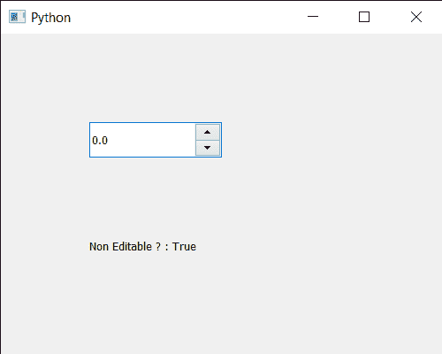

# PyQt5 QDoubleSpinBox–检查是否可编辑

> 原文:[https://www . geesforgeks . org/pyqt 5-qdoublespinbox-检查它是否可编辑/](https://www.geeksforgeeks.org/pyqt5-qdoublespinbox-checking-if-it-is-editable-or-not/)

在本文中，我们将了解如何确定 QDoubleSpinBox 是不可编辑还是可编辑的。默认情况下，当我们创建一个双旋转框时，它是可编辑的，即它的值可以由用户随时更改，尽管借助`setReadOnly`方法使它不可编辑，那么它的值不能更改，用户只能查看该值。

> 为了做到这一点，我们将使用双旋转框对象的`isReadOnly`方法。
> 
> **语法:** dd_spin.isReadOnly()
> 
> **论证:**不需要论证
> 
> **返回:**返回 bool

下面是实现

```
# importing libraries
from PyQt5.QtWidgets import * 
from PyQt5 import QtCore, QtGui
from PyQt5.QtGui import * 
from PyQt5.QtCore import * 
import sys

class Window(QMainWindow):

    def __init__(self):
        super().__init__()

        # setting title
        self.setWindowTitle("Python ")

        # setting geometry
        self.setGeometry(100, 100, 500, 400)

        # calling method
        self.UiComponents()

        # showing all the widgets
        self.show()

    # method for components
    def UiComponents(self):

        # creating double spin box
        d_spin = QDoubleSpinBox(self)

        # setting geometry to the double spin box
        d_spin.setGeometry(100, 100, 150, 40)

        # setting decimal precision
        d_spin.setDecimals(1)

        # step type
        step_type = QAbstractSpinBox.AdaptiveDecimalStepType

        # adaptive step type
        d_spin.setStepType(step_type)

        # making it non editable
        d_spin.setReadOnly(True)

        # creating a label
        label = QLabel("GeeksforGeeks", self)

        # setting geometry to the label
        label.setGeometry(100, 200, 300, 80)

        # making label multi line
        label.setWordWrap(True)

        # checking if it is non editable
        value = d_spin.isReadOnly()

        # setting text to the label
        label.setText("Non Editable ? : " + str(value))

# create pyqt5 app
App = QApplication(sys.argv)

# create the instance of our Window
window = Window()

# start the app
sys.exit(App.exec())
```

**输出:**
