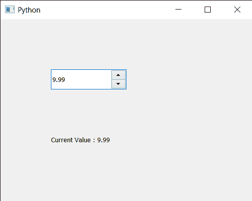

# PyQt5 QDoubleSpinBox–获取当前值

> 原文:[https://www . geeksforgeeks . org/pyqt 5-qdoublespinbox-get-current-value/](https://www.geeksforgeeks.org/pyqt5-qdoublespinbox-getting-current-value/)

在本文中，我们将看到如何获得 QDoubleSpinBox 的当前值。用户可以借助鼠标和键盘将任意十进制值(浮点数)设置到 QDoubleSpinBox 中，但有时为了覆盖用户输入的值，需要编程设置值，可以借助`setValue`方法进行设置。

为了做到这一点，我们将使用`value`方法和 QDateTimeEdit 对象。

> **语法:** d_spin.value()
> 
> **论证:**不需要论证
> 
> **返回:**返回浮点值

下面是实现

```py
# importing libraries
from PyQt5.QtWidgets import * 
from PyQt5 import QtCore, QtGui
from PyQt5.QtGui import * 
from PyQt5.QtCore import * 
import sys

class Window(QMainWindow):

    def __init__(self):
        super().__init__()

        # setting title
        self.setWindowTitle("Python ")

        # setting geometry
        self.setGeometry(100, 100, 500, 400)

        # calling method
        self.UiComponents()

        # showing all the widgets
        self.show()

    # method for components
    def UiComponents(self):

        # creating double spin box
        d_spin = QDoubleSpinBox(self)

        # setting geometry to the double spin box
        d_spin.setGeometry(100, 100, 150, 40)

        # value
        value = 9.99

        # setting current value of the double spin box
        d_spin.setValue(value)

        # creating a label
        label = QLabel("GeeksforGeeks", self)

        # setting geometry to the label
        label.setGeometry(100, 200, 300, 80)

        # making label multi line
        label.setWordWrap(True)

        # getting current value of double spin box
        value = d_spin.value()

        # setting text to the label
        label.setText("Current Value : " + str(value))

# create pyqt5 app
App = QApplication(sys.argv)

# create the instance of our Window
window = Window()

# start the app
sys.exit(App.exec())
```

**输出:**
