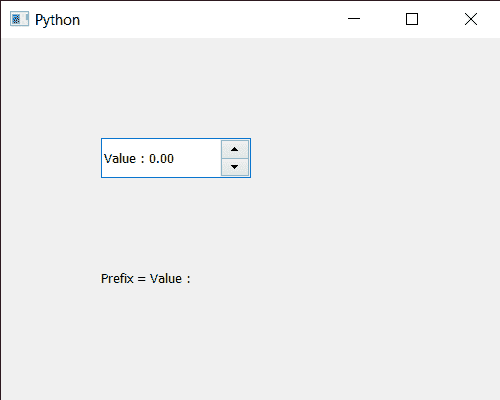

# PyQt5 QDoubleSpinBox–获取前缀

> 原文:[https://www . geeksforgeeks . org/pyqt 5-qdoublespinbox-get-prefix/](https://www.geeksforgeeks.org/pyqt5-qdoublespinbox-getting-prefix/)

在本文中，我们将看到如何获得 QDoubleSpinBox 的前缀。前缀是放在词干前面的词缀。把它加到一个单词的开头会把它变成另一个单词。例如，当前缀 un-被添加到单词 happy 时，它会创建单词 unhappy。默认情况下没有前缀，尽管可以借助`setPrefix`方法在双旋转框值前面添加一个字符串。

> 为了做到这一点，我们将使用双旋转框对象的`prefix`方法。
> 
> **语法:** dd_spin.prefix()
> 
> **论证:**不需要论证
> 
> **返回:**返回字符串

下面是实现

```
# importing libraries
from PyQt5.QtWidgets import * 
from PyQt5 import QtCore, QtGui
from PyQt5.QtGui import * 
from PyQt5.QtCore import * 
import sys

class Window(QMainWindow):

    def __init__(self):
        super().__init__()

        # setting title
        self.setWindowTitle("Python ")

        # setting geometry
        self.setGeometry(100, 100, 500, 400)

        # calling method
        self.UiComponents()

        # showing all the widgets
        self.show()

    # method for components
    def UiComponents(self):

        # creating double spin box
        d_spin = QDoubleSpinBox(self)

        # setting geometry to the double spin box
        d_spin.setGeometry(100, 100, 150, 40)

        # setting prefix
        d_spin.setPrefix("Value : ")

        # step type
        step_type = QAbstractSpinBox.AdaptiveDecimalStepType

        # adaptive step type
        d_spin.setStepType(step_type)

        # creating a label
        label = QLabel("GeeksforGeeks", self)

        # setting geometry to the label
        label.setGeometry(100, 200, 300, 80)

        # making label multi line
        label.setWordWrap(True)

        # getting prefix
        value = d_spin.prefix()

        # setting text to the label
        label.setText("Prefix = " + str(value))

# create pyqt5 app
App = QApplication(sys.argv)

# create the instance of our Window
window = Window()

# start the app
sys.exit(App.exec())
```

**输出:**
