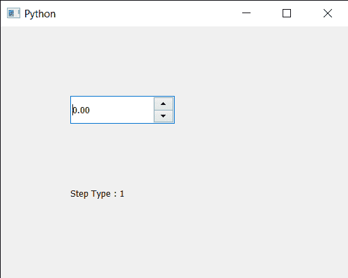

# PyQt5 QDoubleSpinBox–获取步长类型属性

> 原文:[https://www . geesforgeks . org/pyqt5-qdoublespinbox-get-step-type-property/](https://www.geeksforgeeks.org/pyqt5-qdoublespinbox-getting-step-type-property/)

在本文中，我们将看到如何获得 QDoubleSpinBox 的步长类型属性。此属性保存步骤类型。步长类型可以是单步或自适应十进制步长。默认情况下，当我们更改该值时，它会按整数而不是十进制值进行更改。虽然我们可以借助于 step type 属性来更改该值，但它可以借助于`setStepType`方法进行设置。

为了做到这一点，我们将使用`stepType`方法和 QDateTimeEdit 对象。

> **语法:** dd_spin.stepType()
> 
> **论证:**不需要论证
> 
> **返回:**它返回步长类型对象，但打印时会显示与之相关的值

下面是实现

```py
# importing libraries
from PyQt5.QtWidgets import * 
from PyQt5 import QtCore, QtGui
from PyQt5.QtGui import * 
from PyQt5.QtCore import * 
import sys

class Window(QMainWindow):

    def __init__(self):
        super().__init__()

        # setting title
        self.setWindowTitle("Python ")

        # setting geometry
        self.setGeometry(100, 100, 500, 400)

        # calling method
        self.UiComponents()

        # showing all the widgets
        self.show()

    # method for components
    def UiComponents(self):

        # creating double spin box
        d_spin = QDoubleSpinBox(self)

        # setting geometry to the double spin box
        d_spin.setGeometry(100, 100, 150, 40)

        # step type
        step_type = QAbstractSpinBox.AdaptiveDecimalStepType

        # adaptive step type
        d_spin.setStepType(step_type)

        # creating a label
        label = QLabel("GeeksforGeeks", self)

        # setting geometry to the label
        label.setGeometry(100, 200, 300, 80)

        # making label multi line
        label.setWordWrap(True)

        # getting step type
        value = d_spin.stepType()

        # setting text to the label
        label.setText("Step Type : " + str(value))

# create pyqt5 app
App = QApplication(sys.argv)

# create the instance of our Window
window = Window()

# start the app
sys.exit(App.exec())
```

**输出:**
