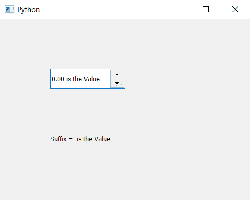

# PyQt5 QDoubleSpinBox–获取后缀

> 原文:[https://www . geeksforgeeks . org/pyqt 5-qdoublespinbox-get-后缀/](https://www.geeksforgeeks.org/pyqt5-qdoublespinbox-getting-suffix/)

在本文中，我们将看到如何获得 QDoubleSpinBox 的后缀。在语言学中，后缀是放在词干后面的词缀。常见的例子是格尾和动词尾，格尾表示名词或形容词的语法格，动词尾构成动词的变化。屈折后缀有时被称为愿望、语法后缀或结尾。默认情况下，双尾旋框没有后缀，尽管我们可以借助 setSuffix 方法为其添加后缀。

> 为了做到这一点，我们将使用后缀方法与双旋转框对象。
> **语法:** dd_spin .后缀()
> **参数:**不需要参数
> **返回:**返回字符串

下面是实现

## 蟒蛇 3

```
# importing libraries
from PyQt5.QtWidgets import *
from PyQt5 import QtCore, QtGui
from PyQt5.QtGui import *
from PyQt5.QtCore import *
import sys

class Window(QMainWindow):

    def __init__(self):
        super().__init__()

        # setting title
        self.setWindowTitle("Python ")

        # setting geometry
        self.setGeometry(100, 100, 500, 400)

        # calling method
        self.UiComponents()

        # showing all the widgets
        self.show()

    # method for components
    def UiComponents(self):

        # creating double spin box
        d_spin = QDoubleSpinBox(self)

        # setting geometry to the double spin box
        d_spin.setGeometry(100, 100, 150, 40)

        # setting suffix
        d_spin.setSuffix(" is the Value")

        # step type
        step_type = QAbstractSpinBox.AdaptiveDecimalStepType

        # adaptive step type
        d_spin.setStepType(step_type)

        # creating a label
        label = QLabel("GeeksforGeeks", self)

        # setting geometry to the label
        label.setGeometry(100, 200, 300, 80)

        # making label multi line
        label.setWordWrap(True)

        # getting suffix
        value = d_spin.suffix()

        # setting text to the label
        label.setText("Suffix = " + str(value))

# create pyqt5 app
App = QApplication(sys.argv)

# create the instance of our Window
window = Window()

# start the app
sys.exit(App.exec())
```

**输出:**

