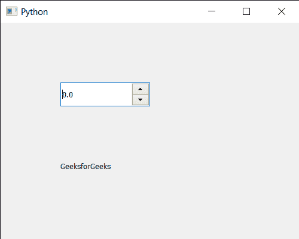

# PYqt5 QDoubleSpinBox–设置线编辑到它

> 原文:[https://www . geesforgeks . org/pyqt 5-qdoublespinbox-设置-行-编辑到 it/](https://www.geeksforgeeks.org/pyqt5-qdoublespinbox-setting-line-edit-to-it/)

在本文中，我们将看到如何将行编辑设置为 QDoubleSpinBox。行编辑是接收输入并显示当前双旋转框值的空白，我们可以随时更改行编辑对象。线编辑是双旋转框的主要组成部分。默认的线编辑是这样进行的，它只接收浮点值。

> 为了做到这一点，我们将使用双旋转框对象的`setLineEdit`方法。
> 
> **语法** dd_spin.setLineEdit(线性编辑)
> 
> **参数:**它以 QLineEdit 对象为参数
> 
> **返回:**返回无

下面是实现

```py
# importing libraries
from PyQt5.QtWidgets import * 
from PyQt5 import QtCore, QtGui
from PyQt5.QtGui import * 
from PyQt5.QtCore import * 
import sys

class Window(QMainWindow):

    def __init__(self):
        super().__init__()

        # setting title
        self.setWindowTitle("Python ")

        # setting geometry
        self.setGeometry(100, 100, 500, 400)

        # calling method
        self.UiComponents()

        # showing all the widgets
        self.show()

    # method for components
    def UiComponents(self):

        # creating double spin box
        d_spin = QDoubleSpinBox(self)

        # setting geometry to the double spin box
        d_spin.setGeometry(100, 100, 150, 40)

        # setting decimal precision
        d_spin.setDecimals(1)

        # step type
        step_type = QAbstractSpinBox.AdaptiveDecimalStepType

        # adaptive step type
        d_spin.setStepType(step_type)

        # line edit
        lineedit = QLineEdit(self)

        # setting line edit to the double spin box
        d_spin.setLineEdit(lineedit)

        # creating a label
        label = QLabel("GeeksforGeeks", self)

        # setting geometry to the label
        label.setGeometry(100, 200, 300, 80)

        # making label multi line
        label.setWordWrap(True)

# create pyqt5 app
App = QApplication(sys.argv)

# create the instance of our Window
window = Window()

# start the app
sys.exit(App.exec())
```

**输出:**
