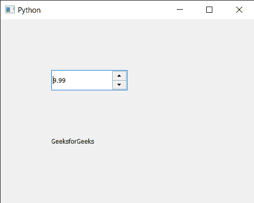

# PyQt5 QDoubleSpinBox–设置值

> 原文:[https://www . geeksforgeeks . org/pyqt 5-qdoublespinbox-setting-value/](https://www.geeksforgeeks.org/pyqt5-qdoublespinbox-setting-value/)

在本文中，我们将看到如何为 QDoubleSpinBox 设置值。用户可以在鼠标和键盘的帮助下将任何十进制值(浮点数)设置到 QDoubleSpinBox，但有时需要通过编程设置值，以覆盖用户输入的值。

为了做到这一点，我们将使用`setValue`方法和 QDateTimeEdit 对象。

> **语法:** d_spin.setValue(val)
> 
> **自变量:**以浮点值为自变量
> 
> **返回:**返回无

下面是实现

```py
# importing libraries
from PyQt5.QtWidgets import * 
from PyQt5 import QtCore, QtGui
from PyQt5.QtGui import * 
from PyQt5.QtCore import * 
import sys

class Window(QMainWindow):

    def __init__(self):
        super().__init__()

        # setting title
        self.setWindowTitle("Python ")

        # setting geometry
        self.setGeometry(100, 100, 500, 400)

        # calling method
        self.UiComponents()

        # showing all the widgets
        self.show()

    # method for components
    def UiComponents(self):

        # creating double spin box
        d_spin = QDoubleSpinBox(self)

        # setting geometry to the double spin box
        d_spin.setGeometry(100, 100, 150, 40)

        # value
        value = 9.99

        # setting current value of the double spin box
        d_spin.setValue(value)

        # creating a label
        label = QLabel("GeeksforGeeks", self)

        # setting geometry to the label
        label.setGeometry(100, 200, 300, 80)

        # making label multi line
        label.setWordWrap(True)

# create pyqt5 app
App = QApplication(sys.argv)

# create the instance of our Window
window = Window()

# start the app
sys.exit(App.exec())
```

**输出:**

