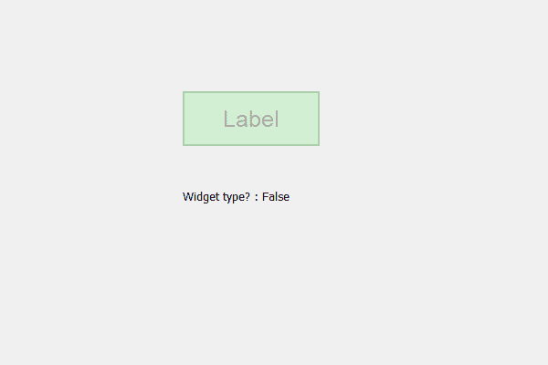

# PyQt5 QLabel–检查不透明度效果是否为小部件类型

> 原文:[https://www . geeksforgeeks . org/pyqt 5-qlabel-checking-如果不透明度-效果是-widget-type/](https://www.geeksforgeeks.org/pyqt5-qlabel-checking-if-the-opacity-effect-is-widget-type/)

在本文中，我们将看到如何检查标签的不透明度效果是否是小部件类型。Widget 类型允许用户知道颜色效果对象是否像标签、按钮等一样是 widget 类型。

为了检查不透明度效果是否是小部件类型，我们使用`isWidgetType`方法。

> **语法:**不透明度 _ 效果. isWidgetType()
> 
> **论证:**不需要论证
> 
> **返回:**返回 bool

下面是实现

```py
# importing libraries
from PyQt5.QtWidgets import * 
from PyQt5 import QtCore, QtGui
from PyQt5.QtGui import * 
from PyQt5.QtCore import * 
import sys

class Window(QMainWindow):

    def __init__(self):
        super().__init__()

        # setting title
        self.setWindowTitle("Python ")

        # setting geometry
        self.setGeometry(100, 100, 600, 400)

        # calling method
        self.UiComponents()

        # showing all the widgets
        self.show()

    # method for widgets
    def UiComponents(self):

        # creating label
        label = QLabel("Label", self)

        # setting geometry to the label
        label.setGeometry(200, 100, 150, 60)

        # setting alignment to the label
        label.setAlignment(Qt.AlignCenter)

        # setting font
        label.setFont(QFont('Arial', 15))

        # setting style sheet of the label
        label.setStyleSheet("QLabel"
                            "{"
                            "border : 2px solid green;"
                            "background : lightgreen;"
                            "}")

        # creating a opacity effect
        self.opacity_effect = QGraphicsOpacityEffect()

        # setting opacity level
        self.opacity_effect.setOpacity(0.3)

        # adding opacity effect to the label
        label.setGraphicsEffect(self.opacity_effect)

        # result label
        result = QLabel(self)

        # setting geometry of the result label
        result.setGeometry(200, 200, 300, 30)

        # checking opacity effect is widget type or not
        check = self.opacity_effect.isWidgetType()

        # setting text to the result label
        result.setText("Widget type? : " + str(check))

# create pyqt5 app
App = QApplication(sys.argv)

# create the instance of our Window
window = Window()

# start the app
sys.exit(App.exec())
```

**输出:**
