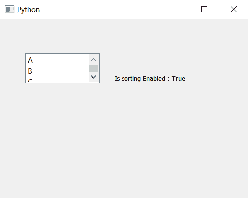

# PYqt5 QlisTwidget–检查排序是否启用

> 原文:[https://www . geeksforgeeks . org/pyqt 5-qlistwigt-checking-如果启用排序-或-否/](https://www.geeksforgeeks.org/pyqt5-qlistwidget-checking-if-sorting-is-enabled-or-not/)

在本文中，我们将看到如何检查 QListWidget 的排序启用属性。QListWidget 是一个便利类，它提供了一个列表视图，带有一个经典的基于项目的界面，用于添加和删除项目。QListWidget 使用内部模型来管理列表中的每个 QListWidgetItem。此属性保存是否启用排序，如果此属性为真，则为列表启用排序，如果属性为假，则不启用排序。默认为假 alt，可以借助`setSortingEnabled`方法进行更改。

> 为了做到这一点，我们将对列表小部件对象使用`isSortingEnabled`方法。
> 
> **语法:**list _ widget . issortingenabled()
> 
> **论证:**不需要论证
> 
> **返回:**返回 bool

下面是实现

```
# importing libraries
from PyQt5.QtWidgets import * 
from PyQt5 import QtCore, QtGui
from PyQt5.QtGui import * 
from PyQt5.QtCore import * 
import sys

class Window(QMainWindow):

    def __init__(self):
        super().__init__()

        # setting title
        self.setWindowTitle("Python ")

        # setting geometry
        self.setGeometry(100, 100, 500, 400)

        # calling method
        self.UiComponents()

        # showing all the widgets
        self.show()

    # method for components
    def UiComponents(self):

        # creating a QListWidget
        list_widget = QListWidget(self)

        # setting geometry to it
        list_widget.setGeometry(50, 70, 150, 60)

        # list widget items
        item1 = QListWidgetItem("A")
        item2 = QListWidgetItem("B")
        item3 = QListWidgetItem("C")

        # adding items to the list widget
        list_widget.addItem(item1)
        list_widget.addItem(item2)
        list_widget.addItem(item3)

        # setting sorting enabled
        list_widget.setSortingEnabled(True)

        # creating a label
        label = QLabel("GeesforGeeks", self)

        # setting geometry to the label
        label.setGeometry(230, 80, 300, 80)

        # making label multi line
        label.setWordWrap(True)

        # checking sorting enabled property
        value = list_widget.isSortingEnabled()

        # setting text to the label
        label.setText("Is sorting Enabled : " + str(value))

# create pyqt5 app
App = QApplication(sys.argv)

# create the instance of our Window
window = Window()

# start the app
sys.exit(App.exec())
```

**输出:**
