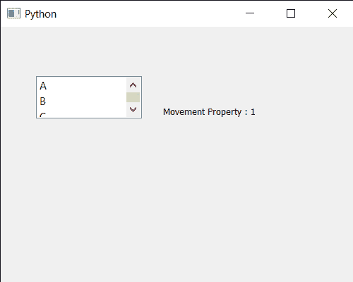

# PyQt5 qlistwigt–获取移动属性

> 原文:[https://www . geeksforgeeks . org/pyqt5-qlistwigt-get-movement-property/](https://www.geeksforgeeks.org/pyqt5-qlistwidget-getting-movement-property/)

在本文中，我们将看到如何获得 QListWidget 的移动属性。QListWidget 是一个便利类，它提供了一个列表视图，带有一个经典的基于项目的界面，用于添加和删除项目。QListWidget 使用内部模型来管理列表中的每个 QListWidgetItem。此属性决定用户如何移动视图中的项目。静态意味着用户不能移动项目。自由意味着用户可以将项目拖放到视图中的任何位置。“捕捉”意味着用户可以拖放项目，但只能拖放到由 gridSize 属性表示的概念网格中的位置。可以借助`setMovement`方法进行设置。

> 为了做到这一点，我们将对列表小部件对象使用`movement`方法。
> 
> **语法:** list_widget.movement()
> 
> **论证:**不需要论证
> 
> **返回:**它返回运动对象，但打印时会显示与之相关的值

下面是实现

```py
# importing libraries
from PyQt5.QtWidgets import * 
from PyQt5 import QtCore, QtGui
from PyQt5.QtGui import * 
from PyQt5.QtCore import * 
import sys

class Window(QMainWindow):

    def __init__(self):
        super().__init__()

        # setting title
        self.setWindowTitle("Python ")

        # setting geometry
        self.setGeometry(100, 100, 500, 400)

        # calling method
        self.UiComponents()

        # showing all the widgets
        self.show()

    # method for components
    def UiComponents(self):

        # creating a QListWidget
        list_widget = QListWidget(self)

        # setting geometry to it
        list_widget.setGeometry(50, 70, 150, 60)

        # list widget items
        item1 = QListWidgetItem("A")
        item2 = QListWidgetItem("B")
        item3 = QListWidgetItem("C")

        # adding items to the list widget
        list_widget.addItem(item1)
        list_widget.addItem(item2)
        list_widget.addItem(item3)

        # setting layout mode
        list_widget.setMovement(QListView.Free)

        # creating a label
        label = QLabel("GeesforGeeks", self)

        # setting geometry to the label
        label.setGeometry(230, 80, 280, 80)

        # making label multi line
        label.setWordWrap(True)

        # getting movement property
        value = list_widget.movement()

        # setting text to the label
        label.setText("Movement Property : " + str(value))

# create pyqt5 app
App = QApplication(sys.argv)

# create the instance of our Window
window = Window()

# start the app
sys.exit(App.exec())
```

**输出:**
