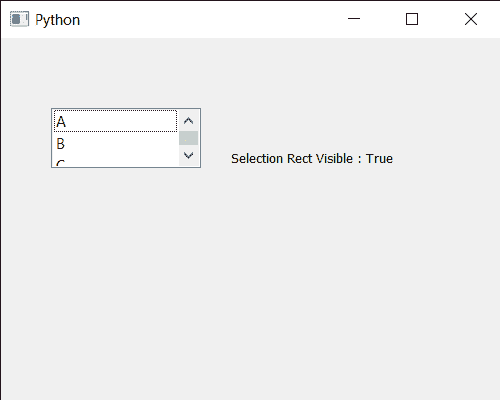

# PyQt5 qlistwigt–获取选择矩形可见属性

> 原文:[https://www . geeksforgeeks . org/pyqt5-qlistwigt-get-selection-rectangle-visible-property/](https://www.geeksforgeeks.org/pyqt5-qlistwidget-getting-selection-rectangle-visible-property/)

在本文中，我们将看到如何获得 QListWidget 的选择矩形可见属性。QListWidget 是一个便利类，它提供了一个列表视图，带有一个经典的基于项目的界面，用于添加和删除项目。QListWidget 使用内部模型来管理列表中的每个 QListWidgetItem。如果该属性为真，则选择矩形可见；否则它将被隐藏。可以借助`setSelectionRectVisible`方法进行设置。

**注意:**选择矩形只有在选择模式为可以选择多个项目的模式时才可见；也就是说，如果选择模式是 qabstraditemview . single selection，它将不会绘制选择矩形。

> 为了做到这一点，我们将对列表小部件对象使用`isSelectionRectVisible`方法。
> 
> **语法:**list _ widget . isselectionvisible()
> 
> **论证:**不需要论证
> 
> **返回:**返回 bool

下面是实现

```py
# importing libraries
from PyQt5.QtWidgets import * 
from PyQt5 import QtCore, QtGui
from PyQt5.QtGui import * 
from PyQt5.QtCore import * 
import sys

class Window(QMainWindow):

    def __init__(self):
        super().__init__()

        # setting title
        self.setWindowTitle("Python ")

        # setting geometry
        self.setGeometry(100, 100, 500, 400)

        # calling method
        self.UiComponents()

        # showing all the widgets
        self.show()

    # method for components
    def UiComponents(self):

        # creating a QListWidget
        list_widget = QListWidget(self)

        # setting geometry to it
        list_widget.setGeometry(50, 70, 150, 60)

        # list widget items
        item1 = QListWidgetItem("A")
        item2 = QListWidgetItem("B")
        item3 = QListWidgetItem("C")

        # adding items to the list widget
        list_widget.addItem(item1)
        list_widget.addItem(item2)
        list_widget.addItem(item3)

        # setting selection mode property
        list_widget.setSelectionMode(QAbstractItemView.MultiSelection)

        # making selection rectangle visible
        list_widget.setSelectionRectVisible(True)

        # creating a label
        label = QLabel("GeesforGeeks", self)

        # setting geometry to the label
        label.setGeometry(230, 80, 280, 80)

        # making label multi line
        label.setWordWrap(True)

        # checking if selection rectangle is visible
        value = list_widget.isSelectionRectVisible()

        # setting text to the label
        label.setText("Selection Rect Visible : " + str(value))

# create pyqt5 app
App = QApplication(sys.argv)

# create the instance of our Window
window = Window()

# start the app
sys.exit(App.exec())
```

**输出:**
