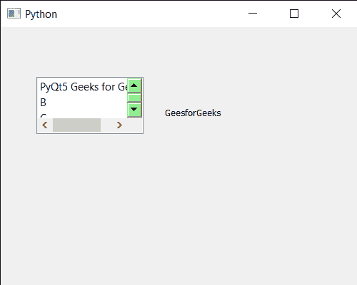

# PyQt5 qlistwigt–设置垂直滚动条

> 原文:[https://www . geeksforgeeks . org/pyqt5-qlistwigt-setting-竖排-滚动条/](https://www.geeksforgeeks.org/pyqt5-qlistwidget-setting-vertical-scroll-bar/)

在本文中，我们将看到如何设置 QListWidget 的垂直滚动条。QListWidget 是一个便利类，它提供了一个列表视图，带有一个经典的基于项目的界面，用于添加和删除项目。QListWidget 使用内部模型来管理列表中的每个 QListWidgetItem。设置垂直滚动条用滚动条替换现有的垂直滚动条，并在新滚动条上设置以前滚动条的所有滑块属性。然后删除以前的滚动条。

> 为了做到这一点，我们将对列表小部件对象使用`setVerticalScrollBar`方法。
> 
> **语法 ：** list_widget.set 垂直滚动条（滚动条）
> 
> **参数:**它以 QScrollBar 对象为参数
> 
> **返回:**返回无

下面是实现

```py
# importing libraries
from PyQt5.QtWidgets import * 
from PyQt5 import QtCore, QtGui
from PyQt5.QtGui import * 
from PyQt5.QtCore import * 
import sys

class Window(QMainWindow):

    def __init__(self):
        super().__init__()

        # setting title
        self.setWindowTitle("Python ")

        # setting geometry
        self.setGeometry(100, 100, 500, 400)

        # calling method
        self.UiComponents()

        # showing all the widgets
        self.show()

    # method for components
    def UiComponents(self):

        # creating a QListWidget
        list_widget = QListWidget(self)

        # setting geometry to it
        list_widget.setGeometry(50, 70, 150, 80)

        # list widget items
        item1 = QListWidgetItem("PyQt5 Geeks for Geeks")
        item2 = QListWidgetItem("B")
        item3 = QListWidgetItem("C")
        item4 = QListWidgetItem("D")

        # adding items to the list widget
        list_widget.addItem(item1)
        list_widget.addItem(item2)
        list_widget.addItem(item3)
        list_widget.addItem(item4)

        # scroll bar
        scroll_bar = QScrollBar(self)

        # setting style sheet to the scroll bar
        scroll_bar.setStyleSheet("background : lightgreen;")

        # setting vertical scroll bar to it
        list_widget.setVerticalScrollBar(scroll_bar)

        # creating a label
        label = QLabel("GeesforGeeks", self)

        # setting geometry to the label
        label.setGeometry(230, 80, 280, 80)

        # making label multi line
        label.setWordWrap(True)

# create pyqt5 app
App = QApplication(sys.argv)

# create the instance of our Window
window = Window()

# start the app
sys.exit(App.exec())
```

**输出:**
