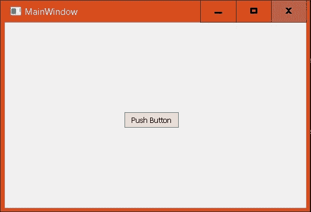
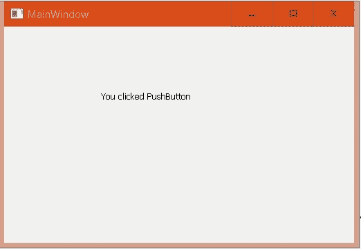

# pyqt 5 qushbutton

> 哎哎哎::1230【https://www . geeksforgeeks . org/pyqt 5-qushbutton/

**qbutton**是 PyQt 中的一个简单按钮，当用户点击时，会执行一些相关的动作。要将此按钮添加到应用程序中，请使用`QPushButton class`。


**示例:**

一个有按钮的窗口，当点击时会出现一条信息“你点击了按钮”。

下面是代码:

```py
from PyQt5 import QtCore, QtGui, QtWidgets
import sys

class Ui_MainWindow(object):

    def setupUi(self, MainWindow):
        MainWindow.resize(506, 312)
        self.centralwidget = QtWidgets.QWidget(MainWindow)

        # adding pushbutton
        self.pushButton = QtWidgets.QPushButton(self.centralwidget)
        self.pushButton.setGeometry(QtCore.QRect(200, 150, 93, 28))

        # adding signal and slot 
        self.pushButton.clicked.connect(self.changelabeltext)

        self.label = QtWidgets.QLabel(self.centralwidget)
        self.label.setGeometry(QtCore.QRect(140, 90, 221, 20))      

        # keeping the text of label empty before button get clicked
        self.label.setText("")     

        MainWindow.setCentralWidget(self.centralwidget)
        self.retranslateUi(MainWindow)
        QtCore.QMetaObject.connectSlotsByName(MainWindow)

    def retranslateUi(self, MainWindow):
        _translate = QtCore.QCoreApplication.translate
        MainWindow.setWindowTitle(_translate("MainWindow", "MainWindow"))
        self.pushButton.setText(_translate("MainWindow", "Push Button"))

    def changelabeltext(self):

        # changing the text of label after button get clicked
        self.label.setText("You clicked PushButton")    

        # Hiding pushbutton from the main window
        # after button get clicked. 
        self.pushButton.hide()   

if __name__ == "__main__": 
    app = QtWidgets.QApplication(sys.argv) 

    MainWindow = QtWidgets.QMainWindow() 
    ui = Ui_MainWindow() 
    ui.setupUi(MainWindow) 
    MainWindow.show()

    sys.exit(app.exec_()) 
```

**输出:**

主窗口有按钮。


点击按钮后，出现消息“您点击了按钮。
