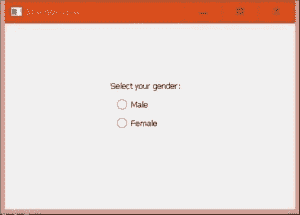
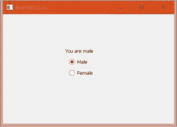
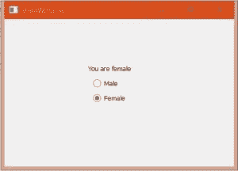

# pyqt 5 qradio

> 哎哎哎:# t0]https://www . geeksforgeeks . org/pyqt 5-qradio/

**单选按钮**为圆形，用于从多个选项中选择一个选项。当圆被填充时，该按钮处于选中状态，当圆为空时，该按钮处于取消选中状态。QRadioButton 类用于在应用程序中添加单选按钮。


**示例:**
要求用户选择用户性别的窗口。根据用户的选择，它显示一条消息:“你是男/女”，如果用户改变他/她的选择，这条消息将会改变。
**下面是代码:**

## 蟒蛇 3

```py
import sys
from PyQt5 import QtCore, QtGui, QtWidgets

class Ui_MainWindow(object):
    def setupUi(self, MainWindow):
        MainWindow.setObjectName("MainWindow")
        MainWindow.resize(466, 299)
        self.centralwidget = QtWidgets.QWidget(MainWindow)

        # Radio button for male
        self.radioButton_male = QtWidgets.QRadioButton(self.centralwidget)
        self.radioButton_male.setGeometry(QtCore.QRect(180, 120, 95, 20))

        # adding signal and slot
        self.radioButton_male.toggled.connect(self.maleselected)

        # Radio button for female
        self.radioButton_female = QtWidgets.QRadioButton(self.centralwidget)
        self.radioButton_female.setGeometry(QtCore.QRect(180, 150, 95, 20))

        # adding signal and slot
        self.radioButton_female.toggled.connect(self.femaleselected)

        self.label = QtWidgets.QLabel(self.centralwidget)
        self.label.setGeometry(QtCore.QRect(170, 90, 211, 20))
        MainWindow.setCentralWidget(self.centralwidget)

        self.retranslateUi(MainWindow)
        QtCore.QMetaObject.connectSlotsByName(MainWindow)

    def maleselected(self, selected):
        if selected:
            self.label.setText("You are male")

    def femaleselected(self, selected):
        if selected:
            self.label.setText("You are female")       

    def retranslateUi(self, MainWindow):
        _translate = QtCore.QCoreApplication.translate

        MainWindow.setWindowTitle(_translate("MainWindow", "MainWindow"))
        self.radioButton_male.setText(_translate("MainWindow", "Male"))
        self.label.setText(_translate("MainWindow", "Select your gender:"))
        self.radioButton_female.setText(_translate("MainWindow", "Female"))

# Driver Code
if __name__ == "__main__":
    app = QtWidgets.QApplication(sys.argv)

    MainWindow = QtWidgets.QMainWindow()
    ui = Ui_MainWindow()
    ui.setupUi(MainWindow)
    MainWindow.show()
    sys.exit(app.exec_())
```

**输出:**



根据用户的选择，将出现一条消息“你是男性”或“你是女性”，该消息将随着用户改变他/她的选择而改变。

 