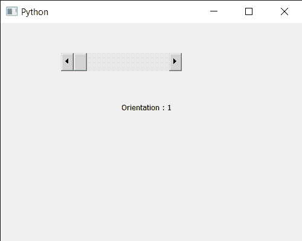

# PyQt5 QScrollBar–获取其方向

> 原文:[https://www . geeksforgeeks . org/pyqt 5-qscrollbar-get-it-orientation/](https://www.geeksforgeeks.org/pyqt5-qscrollbar-getting-its-orientation/)

在本文中，我们将看到如何获得 QScrollBar 的方向属性。QScrollBar 是一个控件，它使用户能够访问比用于显示文档的小部件更大的文档部分。滑块是条内的可滚动对象。滚动条的默认方向是水平的，尽管我们也可以将其水平。水平滚动条将具有与普通滚动条相同的属性。借助`setOrientation`方法可以改变。

> 为此，我们将对滚动条对象使用`orientation`方法。
> 
> **语法:**滚动.方向()
> 
> **论证:**不需要论证
> 
> **返回:**它返回方向对象，但打印时会显示与之相关的值

下面是实现

```py
# importing libraries
from PyQt5.QtWidgets import * 
from PyQt5 import QtCore, QtGui
from PyQt5.QtGui import * 
from PyQt5.QtCore import *
import sys

class Window(QMainWindow):

    def __init__(self):
        super().__init__()

        # setting title
        self.setWindowTitle("Python ")

        # setting geometry
        self.setGeometry(100, 100, 500, 400)

        # calling method
        self.UiComponents()

        # showing all the widgets
        self.show()

    # method for components
    def UiComponents(self):

        scroll = QScrollBar(self)

        # setting geometry of the scroll bar
        scroll.setGeometry(100, 50, 200, 30)

        # making its background color to green
        scroll.setStyleSheet("background : lightgrey;")

        # setting orientation
        scroll.setOrientation(Qt.Horizontal)

        # creating a label
        label = QLabel("GeesforGeeks", self)

        # setting geometry to the label
        label.setGeometry(200, 100, 300, 80)

        # making label multi line
        label.setWordWrap(True)

        # getting value changed signal
        scroll.valueChanged.connect(lambda: do_action())

        # method called when signal is emitted
        def do_action():

            # setting text to the label
            label.setText("Current Value : " + str(scroll.value()))

        # getting orientation property
        value = scroll.orientation()

        # setting text to the label
        label.setText("Orientation : " + str(value))

# create pyqt5 app
App = QApplication(sys.argv)

# create the instance of our Window
window = Window()

# start the app
sys.exit(App.exec())
```

**输出:**

