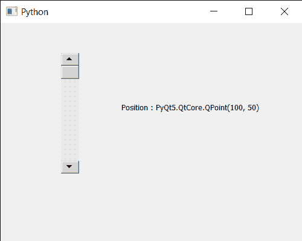

# PyQt5 QScrollBar–获取其在窗口中的位置

> 原文:[https://www . geesforgeks . org/pyqt5-qscrollbar-get-it-in-window-position/](https://www.geeksforgeeks.org/pyqt5-qscrollbar-getting-its-position-in-window/)

在本文中，我们将了解如何获得 QScrollBar 的位置。QScrollBar 是一个控件，它使用户能够访问比用于显示文档的小部件更大的文档部分。滑块是条内的可滚动对象。此属性保存单个步骤。位置是滚动条在窗口中的位置。可以借助于 setGeometry 方法设置位置。

> 为此，我们将使用带有滚动条对象的 pos 方法。
> **语法:** scroll.pos()
> **参数:**不需要参数
> **返回:**返回 QPoint 对象

下面是实现

## 蟒蛇 3

```py
# importing libraries
from PyQt5.QtWidgets import *
from PyQt5 import QtCore, QtGui
from PyQt5.QtGui import *
from PyQt5.QtCore import *
import sys

class Window(QMainWindow):

    def __init__(self):
        super().__init__()

        # setting title
        self.setWindowTitle("Python ")

        # setting geometry
        self.setGeometry(100, 100, 500, 400)

        # calling method
        self.UiComponents()

        # showing all the widgets
        self.show()

    # method for components
    def UiComponents(self):

        scroll = QScrollBar(self)

        # setting geometry of the scroll bar
        scroll.setGeometry(100, 50, 30, 200)

        # making its background color to green
        scroll.setStyleSheet("background : lightgrey;")

        # creating a label
        label = QLabel("GeesforGeeks", self)

        # setting geometry to the label
        label.setGeometry(200, 100, 300, 80)

        # making label multi line
        label.setWordWrap(True)

        # getting value changed signal
        scroll.valueChanged.connect(lambda: do_action())

        # method called when signal is emitted
        def do_action():

            # setting text to the label
            label.setText("Current Value : " + str(scroll.value()))

        # getting position of scroll bar
        value = scroll.pos()

        # setting text to the label
        label.setText("Position : " + str(value))

# create pyqt5 app
App = QApplication(sys.argv)

# create the instance of our Window
window = Window()

# start the app
sys.exit(App.exec())
```

**输出:**

