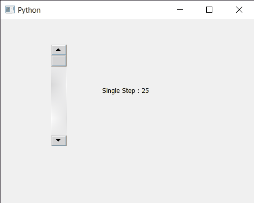

# PyQt5 QScrollBar–单步执行

> 原文:[https://www . geesforgeks . org/pyqt5-qscrollbar-get-单步/](https://www.geeksforgeeks.org/pyqt5-qscrollbar-getting-single-step/)

在本文中，我们将了解如何获得 QScrollBar 的单步属性。QScrollBar 是一个控件，它使用户能够访问比用于显示文档的小部件更大的文档部分。滑块是条内的可滚动对象。此属性保存单个步骤。抽象滑块提供的两个自然步骤中较小的一个，通常对应于用户按下箭头键。如果属性在自动重复按键事件期间被修改，则行为未定义。滚动条单步默认值为 1，可借助`setSingleStep`方法改变。

> 为此，我们将对滚动条对象使用`singleStep`方法。
> 
> **语法:**滚动。单步()
> 
> **论证:**不需要论证
> 
> **返回:**返回整数

下面是实现

```py
# importing libraries
from PyQt5.QtWidgets import * 
from PyQt5 import QtCore, QtGui
from PyQt5.QtGui import * 
from PyQt5.QtCore import * 
import sys

class Window(QMainWindow):

    def __init__(self):
        super().__init__()

        # setting title
        self.setWindowTitle("Python ")

        # setting geometry
        self.setGeometry(100, 100, 500, 400)

        # calling method
        self.UiComponents()

        # showing all the widgets
        self.show()

    # method for components
    def UiComponents(self):

        scroll = QScrollBar(self)

        # setting geometry of the scroll bar
        scroll.setGeometry(100, 50, 30, 200)

        # making its background color to green
        scroll.setStyleSheet("background : lightgrey;")

        # setting single step
        scroll.setSingleStep(25)

        # creating a label
        label = QLabel("GeesforGeeks", self)

        # setting geometry to the label
        label.setGeometry(200, 100, 300, 80)

        # making label multi line
        label.setWordWrap(True)

        # getting value changed signal
        scroll.valueChanged.connect(lambda: do_action())

        # method called when signal is emitted
        def do_action():

            # setting text to the label
            label.setText("Current Value : " + str(scroll.value()))

        # getting orientation property
        value = scroll.singleStep()

        # setting text to the label
        label.setText("Single Step : " + str(value))

# create pyqt5 app
App = QApplication(sys.argv)

# create the instance of our Window
window = Window()

# start the app
sys.exit(App.exec())
```

**输出:**
