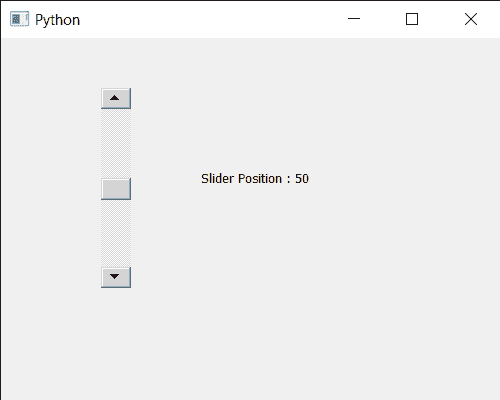

# PyQt5 QScrollBar–获取滑块位置

> 原文:[https://www . geeksforgeeks . org/pyqt5-qscrollbar-get-slider-position/](https://www.geeksforgeeks.org/pyqt5-qscrollbar-getting-slider-position/)

在本文中，我们将看到如何在 QScrollBar 中获得滑块的位置。QScrollBar 是一个控件，它使用户能够访问比用于显示文档的小部件更大的文档部分。滑块是条内的可滚动对象。我们可以借助鼠标和键盘改变它的位置。我们还可以通过 setSliderPosition 方法以编程方式改变它的位置。

> 为此，我们将对滚动条对象使用 sliderPosition 方法。
> **语法:**scroll . sliderposition()
> **参数:**不需要参数
> **返回:**返回整数

**示例:**下面是实现

## 蟒蛇 3

```py
# importing libraries
from PyQt5.QtWidgets import *
from PyQt5 import QtCore, QtGui
from PyQt5.QtGui import *
from PyQt5.QtCore import *
import sys

class Window(QMainWindow):

    def __init__(self):
        super().__init__()

        # setting title
        self.setWindowTitle("Python ")

        # setting geometry
        self.setGeometry(100, 100, 500, 400)

        # calling method
        self.UiComponents()

        # showing all the widgets
        self.show()

    # method for components
    def UiComponents(self):

        scroll = QScrollBar(self)

        # setting geometry of the scroll bar
        scroll.setGeometry(100, 50, 30, 200)

        # making its background color to green
        scroll.setStyleSheet("background : lightgrey;")

        # setting slider position
        scroll.setSliderPosition(50)

        # creating a label
        label = QLabel("GeesforGeeks", self)

        # setting geometry to the label
        label.setGeometry(200, 100, 300, 80)

        # making label multi line
        label.setWordWrap(True)

        # getting current position of the slider
        value = scroll.sliderPosition()

        # setting text to the label
        label.setText("Slider Position : " + str(value))

# create pyqt5 app
App = QApplication(sys.argv)

# create the instance of our Window
window = Window()

# start the app
sys.exit(App.exec())
```

**输出:**

