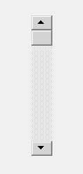

# pyqt 5–qscrollbar

> 哎哎哎::1230【https://www . geeksforgeeks . org/pyqt 5-qscrollbar/

**QScrollBar** 是一个控件，它使用户能够访问比用于显示文档的小部件更大的文档部分。它提供了用户在文档中的当前位置和可见文档量的可视指示。滚动条通常配备有其他控件，以实现更精确的导航。Qt 以适合每个平台的方式显示滚动条。
下面是滚动条的样子



**示例**
我们将创建一个窗口，在其中我们将创建一个 QScrollBar 和 QLabel 小部件，每次滚动条的值发生变化时，它都会显示在标签中
下面是实现方式

## 蟒蛇 3

```
# importing libraries
from PyQt5.QtWidgets import *
from PyQt5 import QtCore, QtGui
from PyQt5.QtGui import *
from PyQt5.QtCore import *
import sys

class Window(QMainWindow):

    def __init__(self):
        super().__init__()

        # setting title
        self.setWindowTitle("Python ")

        # setting geometry
        self.setGeometry(100, 100, 500, 400)

        # calling method
        self.UiComponents()

        # showing all the widgets
        self.show()

    # method for components
    def UiComponents(self):

        scroll = QScrollBar(self)

        # setting geometry of the scroll bar
        scroll.setGeometry(100, 50, 30, 200)

        # making its background color to green
        scroll.setStyleSheet("background : lightgrey;")

        # creating a label
        label = QLabel("GeesforGeeks", self)

        # setting geometry to the label
        label.setGeometry(200, 100, 300, 80)

        # making label multi line
        label.setWordWrap(True)

        # adding action to the scroll bar
        scroll.valueChanged.connect(lambda: do_action())

        # creating a action method
        def do_action():

            # getting current value of scroll bar
            value = scroll.value()

            # setting text to the label
            label.setText("Current Value : " + str(value))

# create pyqt5 app
App = QApplication(sys.argv)

# create the instance of our Window
window = Window()

# start the app
sys.exit(App.exec())
```

**输出:**

<video class="wp-video-shortcode" id="video-460858-1" width="640" height="360" preload="metadata" controls=""><source type="video/mp4" src="https://media.geeksforgeeks.org/wp-content/uploads/20200726024117/Python-2020-07-26-02-40-59.mp4?_=1">[https://media.geeksforgeeks.org/wp-content/uploads/20200726024117/Python-2020-07-26-02-40-59.mp4](https://media.geeksforgeeks.org/wp-content/uploads/20200726024117/Python-2020-07-26-02-40-59.mp4)</video>