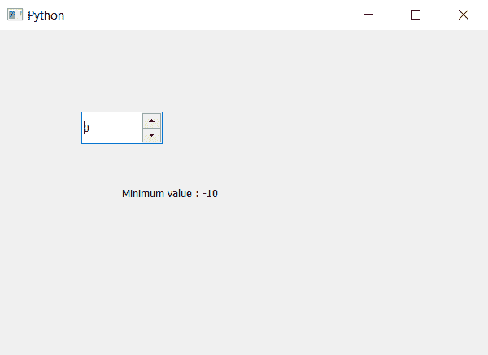

# PyQt5 QSpinBox–访问最小值

> 原文:[https://www . geesforgeks . org/pyqt 5-qspinbox-access-最小值/](https://www.geeksforgeeks.org/pyqt5-qspinbox-access-minimum-value/)

在本文中，我们将看到如何获得最小值，即旋转框的下限，默认情况下，当我们创建一个旋转框时，它的范围从 0 到 99，即它的最小值是 0，尽管我们可以改变这一点。

为了做到这一点，我们将使用`spin_box.minimum`方法。

> **语法:**旋转框。最小值()
> 
> **论证:**不需要论证
> 
> **返回:**返回整数

下面是实现

```
# importing libraries
from PyQt5.QtWidgets import * 
from PyQt5 import QtCore, QtGui
from PyQt5.QtGui import * 
from PyQt5.QtCore import * 
import sys

class Window(QMainWindow):

    def __init__(self):
        super().__init__()

        # setting title
        self.setWindowTitle("Python ")

        # setting geometry
        self.setGeometry(100, 100, 600, 400)

        # calling method
        self.UiComponents()

        # showing all the widgets
        self.show()

    # method for widgets
    def UiComponents(self):

        # creating spin box
        self.spin = QSpinBox(self)

        # setting geometry to spin box
        self.spin.setGeometry(100, 100, 100, 40)

        # setting minimum value
        self.spin.setMinimum(-10)

        # creating label
        label = QLabel(self)

        # setting geometry to the label
        label.setGeometry(150, 180, 200, 40)

        # getting minimum value
        value = self.spin.minimum()

        # setting text to label
        label.setText("Minimum value : " + str(value))

# create pyqt5 app
App = QApplication(sys.argv)

# create the instance of our Window
window = Window()

# start the app
sys.exit(App.exec())
```

**输出:**
