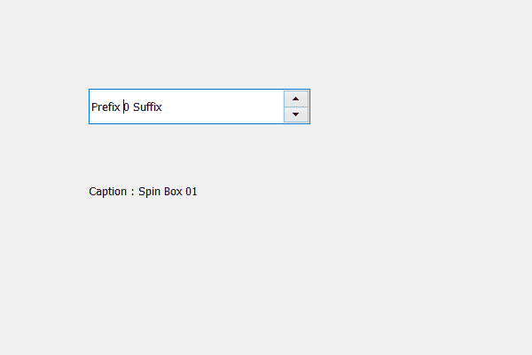

# PyQt5 QSpinBox–访问标题

> 原文:[https://www . geesforgeks . org/pyqt 5-qspinbox-access-caption/](https://www.geeksforgeeks.org/pyqt5-qspinbox-accessing-caption/)

在本文中，我们将看到如何访问旋转框的标题，标题基本上是旋转框的标题，但它不可见标题仅用于后端目的。旋转框的标题类似于主窗口的标题。

为了做到这一点，我们使用`windowTitle`方法。

> **语法:** spin_box.windowTitle()
> 
> **论证:**不需要论证
> 
> **返回:**返回字符串

下面是实现

```
# importing libraries
from PyQt5.QtWidgets import * 
from PyQt5 import QtCore, QtGui
from PyQt5.QtGui import * 
from PyQt5.QtCore import * 
import sys

class Window(QMainWindow):

    def __init__(self):
        super().__init__()

        # setting title
        self.setWindowTitle("Python ")

        # setting geometry
        self.setGeometry(100, 100, 600, 400)

        # calling method
        self.UiComponents()

        # showing all the widgets
        self.show()

    # method for widgets
    def UiComponents(self):
        # creating spin box
        self.spin = QSpinBox(self)

        # setting geometry to spin box
        self.spin.setGeometry(100, 100, 250, 40)

        # setting prefix to spin
        self.spin.setPrefix("Prefix ")

        # setting suffix to spin
        self.spin.setSuffix(" Suffix")

        # caption
        caption = "Spin Box 01"

        # setting caption
        self.spin.setWindowTitle(caption)

        # creating label
        label = QLabel(self)

        # setting geometry to the label
        label.setGeometry(100, 200, 200, 30)

        # getting caption
        get_caption = self.spin.windowTitle()

        # setting text to the label
        label.setText("Caption : " + get_caption)

# create pyqt5 app
App = QApplication(sys.argv)

# create the instance of our Window
window = Window()

# start the app
sys.exit(App.exec())
```

**输出:**
