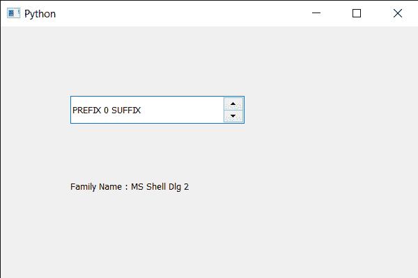

# PyQt5 QSpinBox–访问姓氏

> 原文:[https://www . geeksforgeeks . org/pyqt 5-qspinbox-access-family-name/](https://www.geeksforgeeks.org/pyqt5-qspinbox-accessing-family-name/)

在本文中，我们将看到如何获得旋转框字体的家族名称。家族名称也可以选择性地包括铸造名称，例如“Helvetica[克罗尼克斯]”。如果该系列可从多个铸造厂获得，并且铸造厂未指定，则选择任意铸造厂。如果该系列不可用，将使用字体匹配算法设置一个系列。为了设定姓氏，我们使用`setFamily`方法。

为了获得字体的信息，我们必须获得旋转框的 QFontInfo 对象，这可以使用`fontInfo`方法来完成。

> 为了做到这一点，我们将方法与旋转框的 QFontInfo 对象相关联
> 
> **语法:** font_info.family()
> 
> **论证:**不需要论证
> 
> **返回:**返回字符串

下面是实现

```
# importing libraries
from PyQt5.QtWidgets import * 
from PyQt5 import QtCore, QtGui
from PyQt5.QtGui import * 
from PyQt5.QtCore import * 
import sys

class Window(QMainWindow):

    def __init__(self):
        super().__init__()

        # setting title
        self.setWindowTitle("Python ")

        # setting geometry
        self.setGeometry(100, 100, 600, 400)

        # calling method
        self.UiComponents()

        # showing all the widgets
        self.show()

        # method for widgets
    def UiComponents(self):
        # creating spin box
        self.spin = QSpinBox(self)

        # setting geometry to spin box
        self.spin.setGeometry(100, 100, 250, 40)

        # setting range to the spin box
        self.spin.setRange(0, 999999)

        # setting prefix to spin
        self.spin.setPrefix("PREFIX ")

        # setting suffix to spin
        self.spin.setSuffix(" SUFFIX")

        # creating a label
        label = QLabel(self)

        # setting geometry to the label
        label.setGeometry(100, 200, 300, 60)

        # getting the font info
        font_info = self.spin.fontInfo()

        # getting family name
        name = font_info.family()

        # setting text to the label
        label.setText("Family Name : " + name)

# create pyqt5 app
App = QApplication(sys.argv)

# create the instance of our Window
window = Window()

# start the app
sys.exit(App.exec())
```

**输出:**
