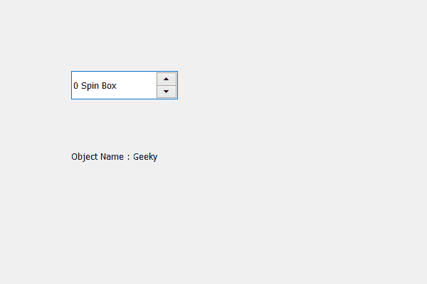

# PyQt5 QSpinBox–访问对象名称

> 原文:[https://www . geeksforgeeks . org/pyqt 5-qspinbox-access-object-name/](https://www.geeksforgeeks.org/pyqt5-qspinbox-accessing-object-name/)

在本文中我们将看到我们如何能够访问旋转框的对象名称，对象名称基本上是赋予旋转框对象的名称，当我们在 PyQt5 应用程序中借助对象名称借助`findChild`方法找到对象时。借助`setObjectName`方法，可以将对象名称设置到旋转框中。

为了做到这一点，我们将使用`objectName`方法。

> **语法:**自旋 _box.objectName()
> 
> **论证:**不需要论证
> 
> **返回:**返回字符串

下面是实现

```py
# importing libraries
from PyQt5.QtWidgets import * 
from PyQt5 import QtCore, QtGui
from PyQt5.QtGui import * 
from PyQt5.QtCore import * 
import sys

class Window(QMainWindow):

    def __init__(self):
        super().__init__()

        # setting title
        self.setWindowTitle("Python ")

        # setting geometry
        self.setGeometry(100, 100, 600, 400)

        # calling method
        self.UiComponents()

        # showing all the widgets
        self.show()

    # method for widgets
    def UiComponents(self):

        # creating spin box
        self.spin = QSpinBox(self)

        # setting geometry to spin box
        self.spin.setGeometry(100, 100, 150, 40)

        # setting suffix to spin
        self.spin.setSuffix(" Spin Box")

        # name
        name = "Geeky"

        # setting up object name
        self.spin.setObjectName(name)

        # creating label
        label = QLabel(self)

        # setting geometry
        label.setGeometry(100, 200, 300, 40)

        # getting object name
        get_name = self.spin.objectName()

        # setting text to the label
        label.setText("Object Name : " + get_name)

# create pyqt5 app
App = QApplication(sys.argv)

# create the instance of our Window
window = Window()

# start the app
sys.exit(App.exec())
```

**输出:**
