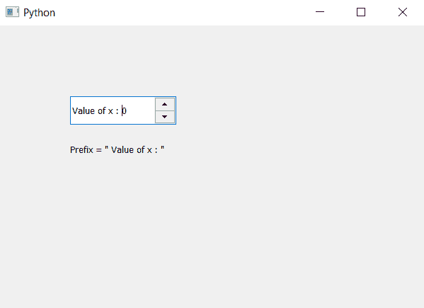

# PyQt5 QSpinBox–访问前缀

> 原文:[https://www . geeksforgeeks . org/pyqt 5-qspinbox-access-prefix/](https://www.geeksforgeeks.org/pyqt5-qspinbox-accessing-prefix/)

在本文中，我们将了解如何访问旋转框的前缀，前缀基本上是插入旋转框值之前的文本，对于旋转框的每个值，前缀保持不变，即不可编辑。默认情况下，旋转框没有设置前缀，我们使用`setPrifix`方法设置前缀。

为了访问前缀，我们将使用`prifix`方法。

> **语法:** spin_box.prifix()
> 
> **论证:**不需要论证
> 
> **返回:**返回字符串

**实施步骤:**
1。创建旋转框
2。在旋转框中添加前缀
3。创建标签以显示前缀
4。借助`prifix`方法
5 访问前缀。使用`setText`方法在标签中显示前缀

下面是实现

```
# importing libraries
from PyQt5.QtWidgets import *
from PyQt5 import QtCore, QtGui
from PyQt5.QtGui import * 
from PyQt5.QtCore import * 
import sys

class Window(QMainWindow):

    def __init__(self):
        super().__init__()

        # setting title
        self.setWindowTitle("Python ")

        # setting geometry
        self.setGeometry(100, 100, 600, 400)

        # calling method
        self.UiComponents()

        # showing all the widgets
        self.show()

    # method for widgets
    def UiComponents(self):

        # creating spin box
        self.spin = QSpinBox(self)

        # setting geometry to spin box
        self.spin.setGeometry(100, 100, 150, 40)

        # adding prefix in combo box
        self.spin.setPrefix("Value of x : ")

        # creating label to show the prefix
        label = QLabel(self)

        # setting geometry of label
        label.setGeometry(100, 160, 200, 30)

        # getting prefix of spin box
        text = self.spin.prefix()

        # showing prefix through label
        label.setText("Prefix = \" " + text + "\"")

# create pyqt5 app
App = QApplication(sys.argv)

# create the instance of our Window
window = Window()

# start the app
sys.exit(App.exec())
```

**输出:**
