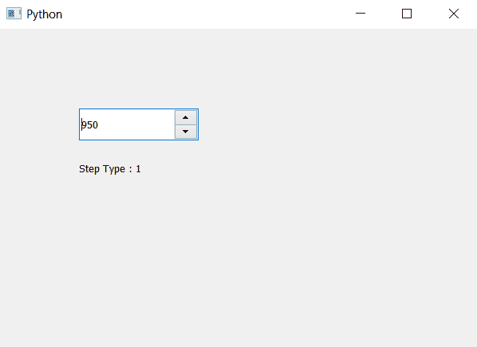

# PyQt5 QSpinBox–访问步骤类型

> 原文:[https://www . geeksforgeeks . org/pyqt 5-qspinbox-access-step-type/](https://www.geeksforgeeks.org/pyqt5-qspinbox-accessing-step-type/)

在本文中，我们将看到如何访问微调框的步长类型，有两种类型的步长类型，即默认的一种是正常递增值，另一种是自适应小数。

为了做到这一点，我们将使用`stepType`方法

**注意:**这个特性是在 Qt 5.12 中引入的。所以低版本没有这个功能。

> **语法:**自旋 _box.stepType()
> 
> **论证:**不需要论证
> 
> **Return :** 它返回 QAbstractionSpinBox 对象，但当它打印时，它显示值 0 或 1

**实施步骤:**
1。创建旋转框
2。借助
3 中的设置步长方法为其设置步长类型。创建标签以显示步骤类型
4。借助 step type 方法
5 获取步骤类型。通过标签显示类型

下面是实现

```py
# importing libraries
from PyQt5.QtWidgets import * 
from PyQt5 import QtCore, QtGui
from PyQt5.QtGui import * 
from PyQt5.QtCore import * 
import sys

class Window(QMainWindow):

    def __init__(self):
        super().__init__()

        # setting title
        self.setWindowTitle("Python ")

        # setting geometry
        self.setGeometry(100, 100, 600, 400)

        # calling method
        self.UiComponents()

        # showing all the widgets
        self.show()

    # method for widgets
    def UiComponents(self):

        # creating spin box
        self.spin = QSpinBox(self)

        # setting geometry to spin box
        self.spin.setGeometry(100, 100, 150, 40)

        # setting range
        self.spin.setRange(0, 10000)

        # setting value
        self.spin.setValue(950)

        # setting step type
        self.spin.setStepType(QAbstractSpinBox.AdaptiveDecimalStepType)

        # creating label
        label = QLabel(self)

        # setting geometry to the label
        label.setGeometry(100, 160, 200, 30)

        # getting single step size
        step_type = self.spin.stepType()

        # setting text to the label
        label.setText("Step Type : " + str(step_type))

# create pyqt5 app
App = QApplication(sys.argv)

# create the instance of our Window
window = Window()

# start the app
sys.exit(App.exec())
```

**输出:**
