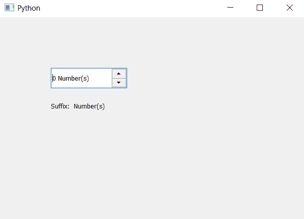

# PyQt5 QSpinBox–访问后缀

> 原文:[https://www . geeksforgeeks . org/pyqt 5-qspinbox-access-后缀/](https://www.geeksforgeeks.org/pyqt5-qspinbox-accessing-suffix/)

在本文中，我们将看到如何访问尾号框的后缀，后缀是在值的末尾添加的额外文本，它是不可编辑和永久的。默认情况下，旋转框没有设置后缀，尽管我们可以借助`setSuffix`方法随时设置后缀。

为了做到这一点，我们将使用`suffix`方法。

> **语法:**自旋 _box .后缀()
> 
> **论证:**不需要论证
> 
> **返回:**返回字符串

**实施步骤:**
1。创建旋转框
2。借助设置后缀方法设置后缀
3。创建标签以显示后缀
4。借助后缀法
5 获取后缀。通过标签显示后缀

下面是实现

```py
# importing libraries
from PyQt5.QtWidgets import * 
from PyQt5 import QtCore, QtGui
from PyQt5.QtGui import * 
from PyQt5.QtCore import * 
import sys

class Window(QMainWindow):

    def __init__(self):
        super().__init__()

        # setting title
        self.setWindowTitle("Python ")

        # setting geometry
        self.setGeometry(100, 100, 600, 400)

        # calling method
        self.UiComponents()

        # showing all the widgets
        self.show()

    # method for widgets
    def UiComponents(self):

        # creating spin box
        self.spin = QSpinBox(self)

        # setting geometry to spin box
        self.spin.setGeometry(100, 100, 150, 40)

        # setting step type
        self.spin.setSuffix(" Number(s)")

        # creating label
        label = QLabel(self)

        # setting geometry to the label
        label.setGeometry(100, 160, 200, 30)

        # getting suffix
        suffix = self.spin.suffix()

        # setting text to the label
        label.setText("Suffix: " + suffix)

# create pyqt5 app
App = QApplication(sys.argv)

# create the instance of our Window
window = Window()

# start the app
sys.exit(App.exec())
```

**输出:**
