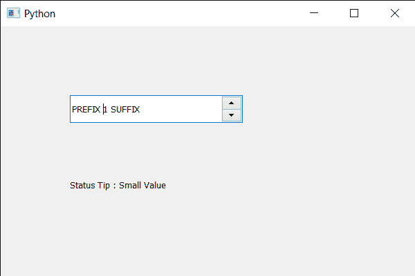

# PyQt5 QSpinBox–访问状态提示

> 原文:[https://www . geesforgeks . org/pyqt5-qspinbox-access-the-status-tip/](https://www.geeksforgeeks.org/pyqt5-qspinbox-accessing-the-status-tip/)

在本文中，我们将了解如何获取旋转框的状态提示。状态提示基本上是开发人员设置的文本，用于将旋转框状态的提示(信息)提供给其他开发人员。例如，当状态提示的值大于 90 时，我们可以将其设置为“高值”。我们可以借助`setStatusTip`方法给旋转框添加状态提示。

为了做到这一点，我们对旋转框对象使用`statusTip`方法。

> **语法:**自旋 _ box.statusTip()
> 
> **论证:**不需要论证
> 
> **返回:**返回字符串

下面是实现

```py
# importing libraries
from PyQt5.QtWidgets import * 
from PyQt5 import QtCore, QtGui
from PyQt5.QtGui import * 
from PyQt5.QtCore import * 
import sys

class Window(QMainWindow):

    def __init__(self):
        super().__init__()

        # setting title
        self.setWindowTitle("Python ")

        # setting geometry
        self.setGeometry(100, 100, 600, 400)

        # calling method
        self.UiComponents()

        # showing all the widgets
        self.show()

        # method for widgets
    def UiComponents(self):
        # creating spin box
        self.spin = QSpinBox(self)

        # setting geometry to spin box
        self.spin.setGeometry(100, 100, 250, 40)

        # setting range to the spin box
        self.spin.setRange(1, 999999)

        # setting prefix to spin
        self.spin.setPrefix("PREFIX ")

        # setting suffix to spin
        self.spin.setSuffix(" SUFFIX")

        # setting status tip to the spin box
        self.spin.setStatusTip("Small Value")

        # creating a label
        self.label = QLabel(self)

        # making label multi line
        self.label.setWordWrap(True)

        # setting label geometry
        self.label.setGeometry(100, 200, 250, 60)

        # getting status tip
        value = self.spin.statusTip()

        # setting text to the label
        self.label.setText("Status Tip : " + str(value))

# create pyqt5 app
App = QApplication(sys.argv)

# create the instance of our Window
window = Window()

# start the app
sys.exit(App.exec())
```

**输出:**
