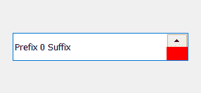
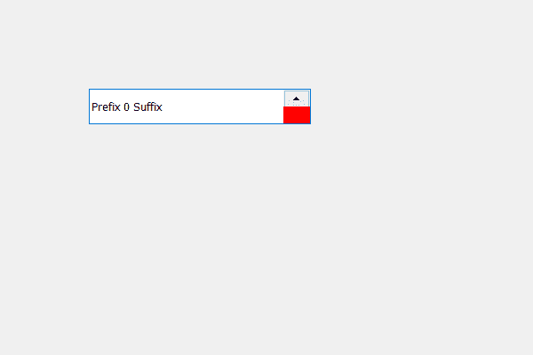

# PyQt5 QSpinBox–为向下按钮

添加背景色

> 原文:[https://www . geeksforgeeks . org/pyqt 5-qspinbox-添加-背景色-向下按钮/](https://www.geeksforgeeks.org/pyqt5-qspinbox-adding-background-color-to-the-down-button/)

在本文中，我们将看到如何设置旋转框的向下按钮的背景颜色。旋转框基本上有三个组成部分一个是行编辑另外两个是向上和向下按钮，向下按钮用来递减数值。下面是向下按钮的背景颜色的表示。



为了做到这一点，我们必须改变与旋转框相关的样式表，下面是样式表代码

```
QSpinBox::down-button
{
background-color : red;
}

```

下面是实现

```
# importing libraries
from PyQt5.QtWidgets import * 
from PyQt5 import QtCore, QtGui
from PyQt5.QtGui import * 
from PyQt5.QtCore import *
import sys

class Window(QMainWindow):

    def __init__(self):
        super().__init__()

        # setting title
        self.setWindowTitle("Python ")

        # setting geometry
        self.setGeometry(100, 100, 600, 400)

        # calling method
        self.UiComponents()

        # showing all the widgets
        self.show()

    # method for widgets
    def UiComponents(self):
        # creating spin box
        self.spin = QSpinBox(self)

        # setting geometry to spin box
        self.spin.setGeometry(100, 100, 250, 40)

        # setting prefix to spin
        self.spin.setPrefix("Prefix ")

        # setting suffix to spin
        self.spin.setSuffix(" Suffix")

        # setting style sheet of spin box
        # adding background color to the down-button
        self.spin.setStyleSheet("QSpinBox::down-button"
                                "{"
                                "background-color : red;"
                                "}")

# create pyqt5 app
App = QApplication(sys.argv)

# create the instance of our Window
window = Window()

# start the app
sys.exit(App.exec())
```

**输出:**
