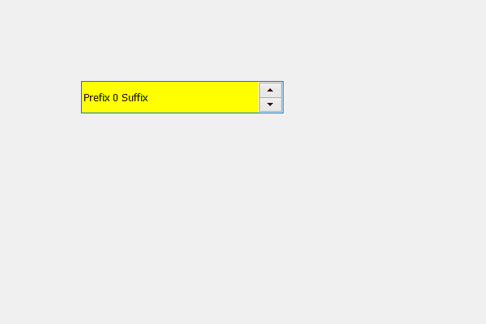

# PyQt5 QSpinBox–为线条编辑部分添加背景色

> 原文:[https://www . geesforgeks . org/pyqt 5-qspinbox-添加-背景色-到线-编辑-零件/](https://www.geeksforgeeks.org/pyqt5-qspinbox-adding-background-color-to-the-line-edit-part/)

在本文中，我们将看到如何为旋转框的线条编辑部分设置背景颜色，线条编辑部分是旋转框的文本部分，在这里我们可以看到文本并输入用户值。

**为了做到这一点，我们必须做到以下几点–**
1。创建旋转框
2。获取旋转框线编辑对象
3。向行编辑对象添加顺序

**语法:**

```
# get the line edit object
line = self.spin_box.lineEdit()

# setting background color to the line edit object
line.setStyleSheet("QLineEdit"
                   "{"
                   "background-color : yellow;"
                   "}")

```

下面是实现

```
# importing libraries
from PyQt5.QtWidgets import * 
from PyQt5 import QtCore, QtGui
from PyQt5.QtGui import * 
from PyQt5.QtCore import * 
import sys

class Window(QMainWindow):

    def __init__(self):
        super().__init__()

        # setting title
        self.setWindowTitle("Python ")

        # setting geometry
        self.setGeometry(100, 100, 600, 400)

        # calling method
        self.UiComponents()

        # showing all the widgets
        self.show()

    # method for widgets
    def UiComponents(self):
        # creating spin box
        self.spin = QSpinBox(self)

        # setting geometry to spin box
        self.spin.setGeometry(100, 100, 250, 40)

        # setting prefix to spin
        self.spin.setPrefix("Prefix ")

        # setting suffix to spin
        self.spin.setSuffix(" Suffix")

        # get the line edit object
        line = self.spin.lineEdit()

        # setting background color to the line edit object
        line.setStyleSheet("QLineEdit"
                           "{"
                           "background-color : yellow;"
                           "}")

# create pyqt5 app
App = QApplication(sys.argv)

# create the instance of our Window
window = Window()

# start the app
sys.exit(App.exec())
```

**输出:**
