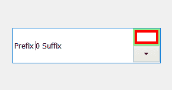
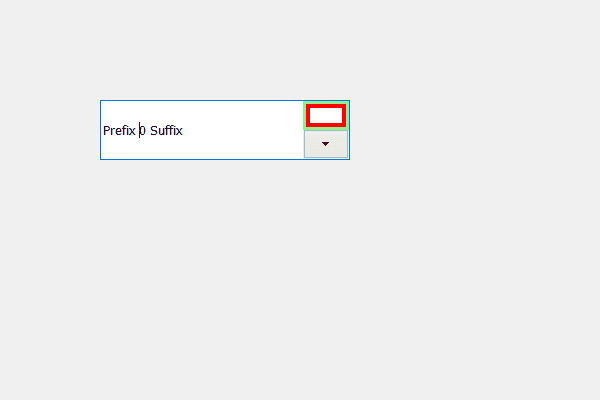

# PyQt5 QSpinBox–向上箭头

添加边框

> 原文:[https://www . geesforgeks . org/pyqt5-qspinbox-向上箭头添加边框/](https://www.geeksforgeeks.org/pyqt5-qspinbox-adding-border-to-the-up-arrow/)

在本文中，我们将看到如何给向上箭头添加边框，我们知道在旋转框中存在两个向上和向下的按钮，向上箭头是向上按钮的内部部分。向上箭头是向上按钮的子集，向上按钮是旋转框的子集。默认情况下，向上箭头没有边框，下面是向上箭头的边框外观。



为了做到这一点，我们必须改变与旋转框相关的样式表代码，下面是样式表代码

```
QSpinBox::down-arrow
{
border : 4px solid red;
}

```

下面是实现

```
# importing libraries
from PyQt5.QtWidgets import * 
from PyQt5 import QtCore, QtGui
from PyQt5.QtGui import * 
from PyQt5.QtCore import * 
import sys

class Window(QMainWindow):

    def __init__(self):
        super().__init__()

        # setting title
        self.setWindowTitle("Python ")

        # setting geometry
        self.setGeometry(100, 100, 600, 400)

        # calling method
        self.UiComponents()

        # showing all the widgets
        self.show()

    # method for widgets
    def UiComponents(self):
        # creating spin box
        self.spin = QSpinBox(self)

        # setting geometry to spin box
        self.spin.setGeometry(100, 100, 250, 60)

        # setting prefix to spin
        self.spin.setPrefix("Prefix ")

        # setting suffix to spin
        self.spin.setSuffix(" Suffix")

        # setting style sheet to the spin box
        # adding border to the down button
        # adding border to the up arrow
        self.spin.setStyleSheet("QSpinBox::up-button"
                                "{"
                                "border : 3px solid lightgreen;"
                                "}"
                                "QSpinBox::up-arrow"
                                "{"
                                "border : 4px solid red;"
                                "}")

# create pyqt5 app
App = QApplication(sys.argv)

# create the instance of our Window
window = Window()

# start the app
sys.exit(App.exec())
```

**输出:**
