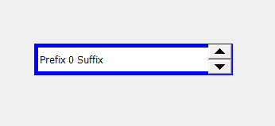
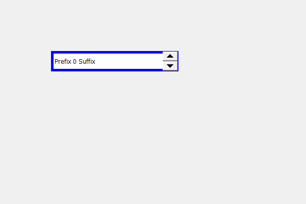

# PyQt5 QSpinBox–添加边框

> 原文:[https://www.geeksforgeeks.org/pyqt5-qspinbox-adding-border/](https://www.geeksforgeeks.org/pyqt5-qspinbox-adding-border/)

在这篇文章中，我们将看到如何添加边框到旋转框，默认情况下旋转框有一个黑色边框，虽然我们可以改变它下面是自定义边框的样子。



为了做到这一点，我们必须改变与旋转框相关的样式表代码，下面是样式表代码

```py
QSpinBox
{
border : 5px solid blue;
}

```

下面是实现

```py
# importing libraries
from PyQt5.QtWidgets import * 
from PyQt5 import QtCore, QtGui
from PyQt5.QtGui import * 
from PyQt5.QtCore import * 
import sys

class Window(QMainWindow):

    def __init__(self):
        super().__init__()

        # setting title
        self.setWindowTitle("Python ")

        # setting geometry
        self.setGeometry(100, 100, 600, 400)

        # calling method
        self.UiComponents()

        # showing all the widgets
        self.show()

    # method for widgets
    def UiComponents(self):
        # creating spin box
        self.spin = QSpinBox(self)

        # setting geometry to spin box
        self.spin.setGeometry(100, 100, 250, 40)

        # setting prefix to spin
        self.spin.setPrefix("Prefix ")

        # setting suffix to spin
        self.spin.setSuffix(" Suffix")

        # setting style sheet to the spin box
        # adding border to the spin box
        self.spin.setStyleSheet("QSpinBox"
                                "{"
                                "border : 5px solid blue;"
                                "}")

# create pyqt5 app
App = QApplication(sys.argv)

# create the instance of our Window
window = Window()

# start the app
sys.exit(App.exec())
```

**输出:**
