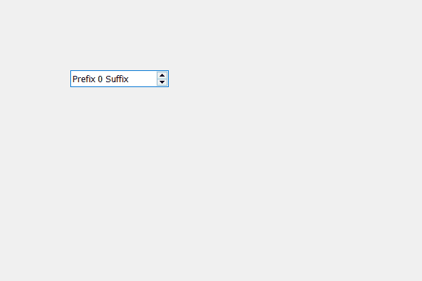

# PyQt5 QSpinBox–根据文本调整大小

> 原文:[https://www . geeksforgeeks . org/pyqt 5-qspinbox-根据文本调整大小/](https://www.geeksforgeeks.org/pyqt5-qspinbox-adjusting-size-according-to-the-text/)

在本文中，我们将看到如何根据旋转框中的文本来调整旋转框的大小。当我们创建一个旋转框时，它的值增加了，那么文本大小也增加了，因为它需要设置旋转框的大小，这样它就可以覆盖整个文本，而不会占用额外的空间。文本包括前缀、后缀和长度最大的值。

为了做到这一点，我们使用调整大小的方法。

> **语法:**旋转框.调整大小()
> 
> **论证:**不需要论证
> 
> **执行的动作:**根据文本改变旋转框的大小

下面是实现

```
# importing libraries
from PyQt5.QtWidgets import * 
from PyQt5 import QtCore, QtGui
from PyQt5.QtGui import * 
from PyQt5.QtCore import * 
import sys

class Window(QMainWindow):

    def __init__(self):
        super().__init__()

        # setting title
        self.setWindowTitle("Python ")

        # setting geometry
        self.setGeometry(100, 100, 600, 400)

        # calling method
        self.UiComponents()

        # showing all the widgets
        self.show()

    # method for widgets
    def UiComponents(self):
        # creating spin box
        self.spin = QSpinBox(self)

        # setting geometry to spin box
        self.spin.setGeometry(100, 100, 250, 40)

        # setting prefix to spin
        self.spin.setPrefix("Prefix ")

        # setting suffix to spin
        self.spin.setSuffix(" Suffix")

        # setting range to the spin box
        self.spin.setRange(0, 999999)

        # adjusting the size of the spin box
        self.spin.adjustSize()

# create pyqt5 app
App = QApplication(sys.argv)

# create the instance of our Window
window = Window()

# start the app
sys.exit(App.exec())
```

**输出:**
