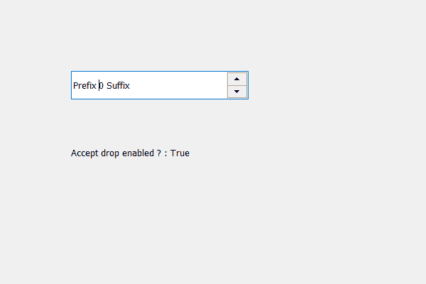

# PyQt5 QSpinbox–检查是否启用接受跌落

> 原文:[https://www . geesforgeks . org/pyqt5-qspinbox-checking-if-accept-drops-is-enabled-or-not/](https://www.geeksforgeeks.org/pyqt5-qspinbox-checking-if-accept-drops-is-enabled-or-not/)

在本文中，我们将看到如何检查旋转框中的液滴接受是否启用，我们使用`setAcceptDrops`方法启用接受液滴。为了检查旋转框的 accept drops 属性是否启用，我们使用`acceptDrops`方法。

为此，我们使用带有旋转框的 acceptDrops 方法。

> **语法:**line _ edit . accept drop()
> 
> **论证:**不需要论证
> 
> **返回:**返回 bool

下面是实现

```py
# importing libraries
from PyQt5.QtWidgets import * 
from PyQt5 import QtCore, QtGui
from PyQt5.QtGui import * 
from PyQt5.QtCore import * 
import sys

class Window(QMainWindow):

    def __init__(self):
        super().__init__()

        # setting title
        self.setWindowTitle("Python ")

        # setting geometry
        self.setGeometry(100, 100, 600, 400)

        # calling method
        self.UiComponents()

        # showing all the widgets
        self.show()

    # method for widgets
    def UiComponents(self):
        # creating spin box
        self.spin = QSpinBox(self)

        # setting geometry to spin box
        self.spin.setGeometry(100, 100, 250, 40)

        # setting prefix to spin
        self.spin.setPrefix("Prefix ")

        # setting suffix to spin
        self.spin.setSuffix(" Suffix")

        # making accept drop enabled
        self.spin.setAcceptDrops(True)

        # creating a label
        label = QLabel(self)

        # setting geometry to the label
        label.setGeometry(100, 200, 200, 30)

        # checking if accept drop is enabled
        check = self.spin.acceptDrops()

        # setting text to the label
        label.setText("Accept drop enabled ? : " + str(check))

# create pyqt5 app
App = QApplication(sys.argv)

# create the instance of our Window
window = Window()

# start the app
sys.exit(App.exec())
```

**输出:**
