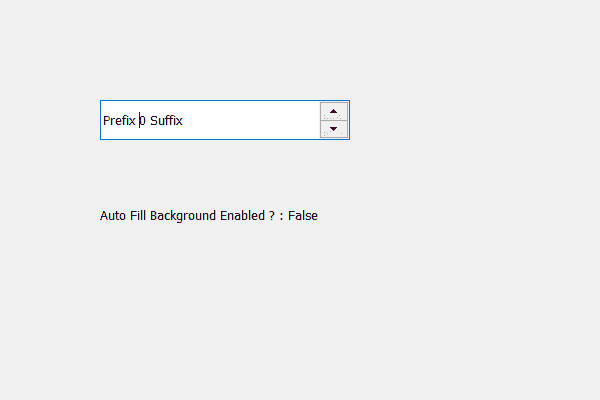

# PyQt5 QSpinBox–检查自动填充背景属性是否启用

> 原文:[https://www . geesforgeks . org/pyqt5-qspinbox-checking-if-auto-fill-background-property-enabled-or-not/](https://www.geeksforgeeks.org/pyqt5-qspinbox-checking-if-auto-fill-background-property-is-enabled-or-not/)

在本文中，我们将了解如何查看旋转框的自动填充属性是否启用，该属性将导致 Qt 在调用 paint 事件之前填充旋转框的背景。使用的颜色由旋转框调色板中的`QPalette.Window`颜色角色定义。默认情况下，该属性为假，尽管我们可以使用`setAutoFillBackground`方法进行更改。

为此，我们使用自动填充背景方法。

> **语法:**自旋 _ box.autoFillBackground()
> 
> **论证:**不需要论证
> 
> **返回:**返回 bool

下面是实现

```py
# importing libraries
from PyQt5.QtWidgets import * 
from PyQt5 import QtCore, QtGui
from PyQt5.QtGui import * 
from PyQt5.QtCore import * 
import sys

class Window(QMainWindow):

    def __init__(self):
        super().__init__()

        # setting title
        self.setWindowTitle("Python ")

        # setting geometry
        self.setGeometry(100, 100, 600, 400)

        # calling method
        self.UiComponents()

        # showing all the widgets
        self.show()

    # method for widgets
    def UiComponents(self):
        # creating spin box
        self.spin = QSpinBox(self)

        # setting geometry to spin box
        self.spin.setGeometry(100, 100, 250, 40)

        # setting prefix to spin
        self.spin.setPrefix("Prefix ")

        # setting suffix to spin
        self.spin.setSuffix(" Suffix")

        # creating a label
        label = QLabel(self)

        # setting geometry to the label
        label.setGeometry(100, 200, 300, 30)

        # checking if auto fill background is enabled
        check = self.autoFillBackground()

        # setting text to the label
        label.setText("Auto Fill Background Enabled ? : " + str(check))

# create pyqt5 app
App = QApplication(sys.argv)

# create the instance of our Window
window = Window()

# start the app
sys.exit(App.exec())
```

**输出:**
