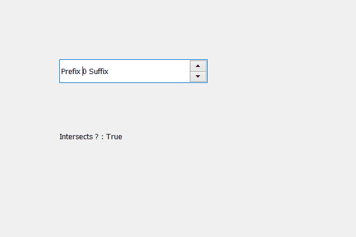

# PyQt5 QSpinBox–检查某个区域是否与子区域相交

> 原文:[https://www . geeksforgeeks . org/pyqt5-qspinbox-checking-如果确定区域与子区域相交/](https://www.geeksforgeeks.org/pyqt5-qspinbox-checking-if-certain-region-intersects-the-children-region/)

在本文中，我们将看到如何检查某个区域它是否可以是 QRect 或 QRegion 与旋转框的子区域相交，子区域保存由旋转框的子区域占据的组合区域。为了得到孩子区域，我们使用`childrenRegion`方法。

> 为此，我们对旋转框的子区域对象使用了相交方法
> 
> **语法:**children _ region . interverses(矩形)
> 
> **自变量:**它以 QRect 对象为自变量，也可以取 QRegion 对象
> 
> **返回:**返回 bool

下面是实现

```py
# importing libraries
from PyQt5.QtWidgets import * 
from PyQt5 import QtCore, QtGui
from PyQt5.QtGui import * 
from PyQt5.QtCore import * 
import sys

class Window(QMainWindow):

    def __init__(self):
        super().__init__()

        # setting title
        self.setWindowTitle("Python ")

        # setting geometry
        self.setGeometry(100, 100, 600, 400)

        # calling method
        self.UiComponents()

        # showing all the widgets
        self.show()

        # method for widgets
    def UiComponents(self):
        # creating spin box
        self.spin = QSpinBox(self)

        # setting geometry to spin box
        self.spin.setGeometry(100, 100, 250, 40)

        # setting range to the spin box
        self.spin.setRange(0, 999999)

        # setting prefix to spin
        self.spin.setPrefix("Prefix ")

        # setting suffix to spin
        self.spin.setSuffix(" Suffix")

        # getting the children region
        children_region = self.spin.childrenRegion()

        # creating a label
        label = QLabel(self)
        label.setWordWrap(True)

        # setting geometry to the label
        label.setGeometry(100, 200, 200, 60)

        # QRect
        rectangle = QRect(1, 1, 20, 30)

        # checking if rectangle intersects the children region
        check = children_region.intersects(rectangle)

        # setting text to the label
        label.setText("Intersects ? : " + str(check))

# create pyqt5 app
App = QApplication(sys.argv)

# create the instance of our Window
window = Window()
window.spin.setFocus()
# start the app
sys.exit(App.exec())
```

**输出:**
